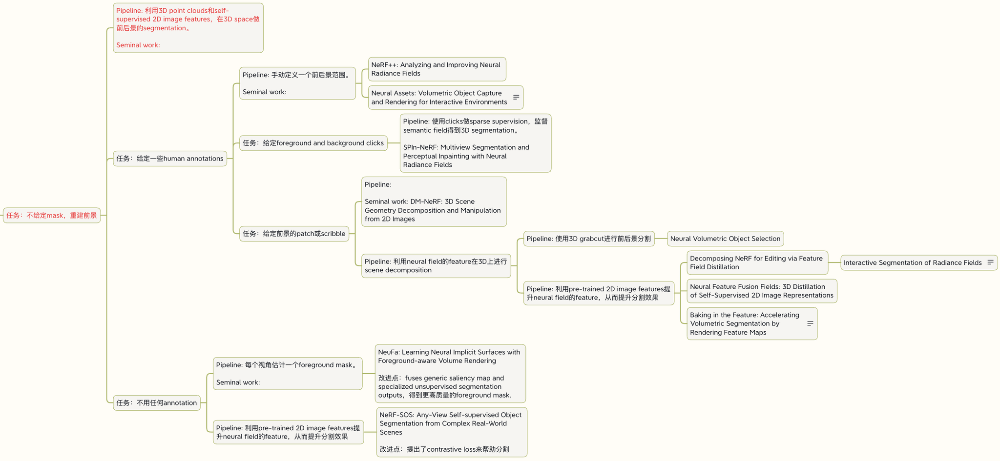

> 本文是 [学习计划参考例子](https://pengsida.notion.site/8911dcc5922b4442a80d4407926e65bf) 在 2026-05-21 的快照，原文档可能在 Notion 上有更新。

初步目标：学习静态场景渲染这个研究方向的论文和算法。

下一步的目标：学习场景解耦与编辑这个研究方向的论文和算法。

计划安排

学习NeRF的算法

看NeRF论文

学习[NeRF代码](https://github.com/yenchenlin/nerf-pytorch)以求完全理解NeRF算法

在这个代码框架下复现NeRF：<https://github.com/pengsida/learning_nerf>

自己拍一个新的数据，在自己写的代码上跑NeRF

学习学长project相关的论文DFF，跑相应的实验

看[DFF的论文](https://pfnet-research.github.io/distilled-feature-fields/)

与学长交流，跑DFF的实验。

学习[DFF代码](https://github.com/pfnet-research/distilled-feature-fields)以求完全理解DFF算法

在做DFF实验的过程中，阅读相关论文。不用一下子全部看完，一篇一篇精读，时间上不急。

