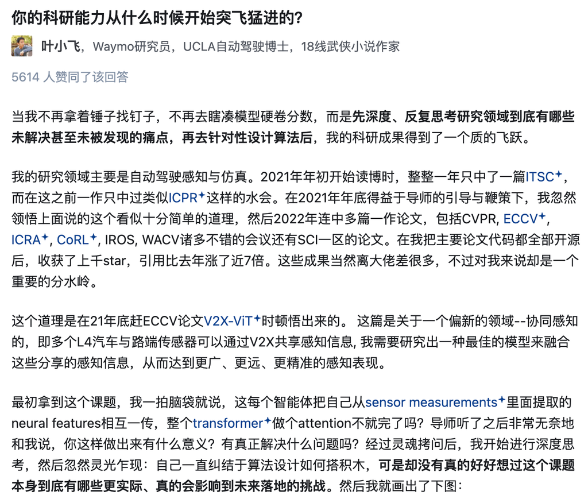
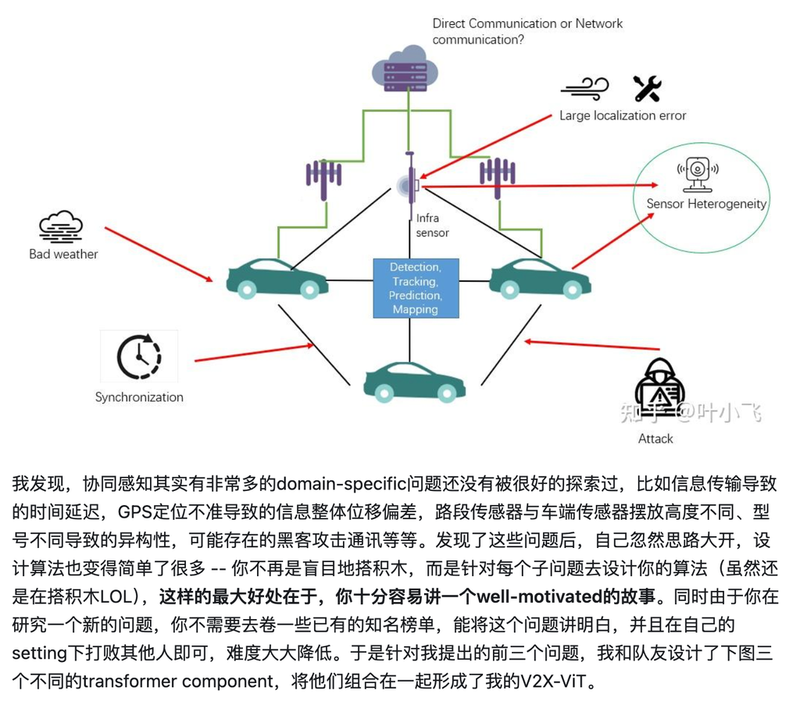
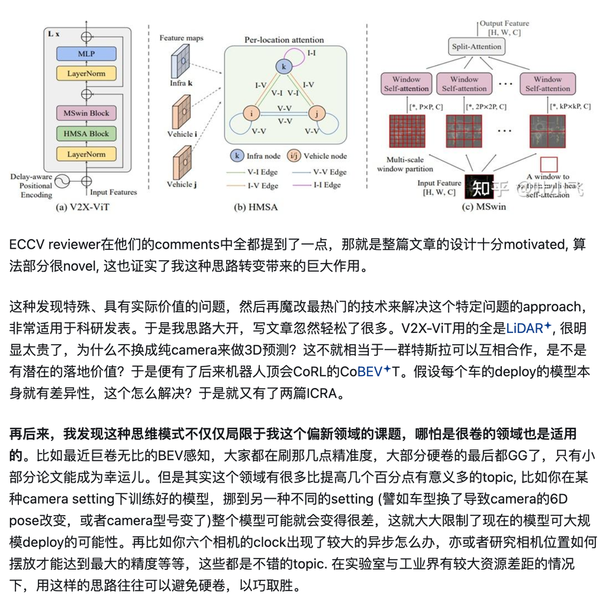
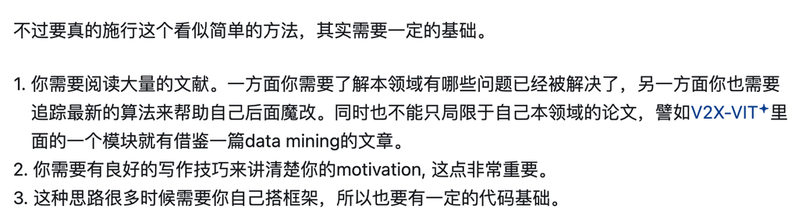
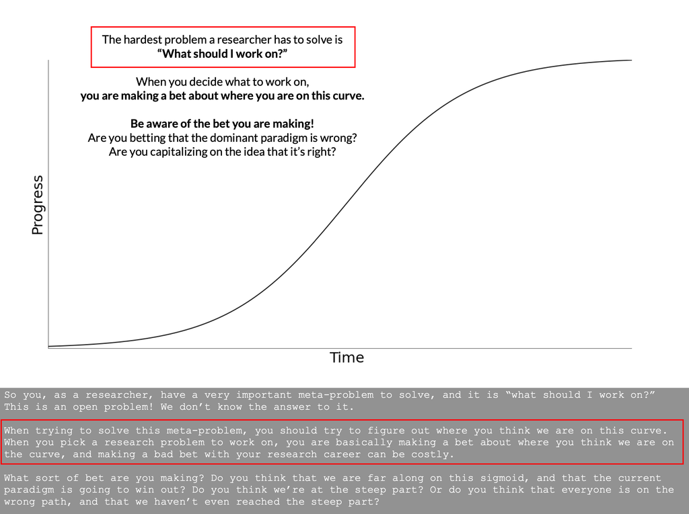
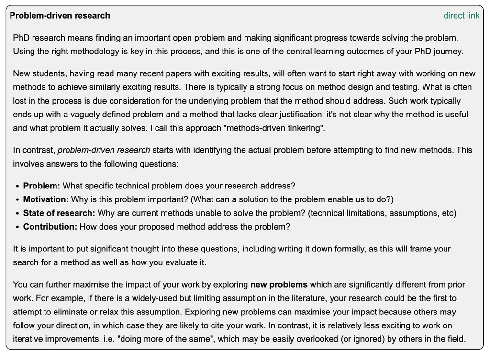

> 本文是 [如何培养想idea的能力（选题能力和解题能力）](https://pengsida.notion.site/idea-da6ce171c13846b7a7ffaa7473ffa6ea) 在 2026-05-21 的快照，原文档可能在 Notion 上有更新。

> 文档汇总（GitHub Repo）：<https://github.com/pengsida/learning_research>

参考文档

John\_Schulman的科研经验.pdf

187.8KB

Michael\_Nielsen的科研经验.pdf

286.0KB

[Michael Nielsen科研经验的中文文档](https://zhuanlan.zhihu.com/p/560852116)

知乎回答

你的科研能力从什么时候开始突飞猛进的？ - 叶小飞的回答 - 知乎
<https://www.zhihu.com/question/524855881/answer/2819447733>

想idea分为两步：选择一个好的问题，然后解决它。

用literature tree（novelty tree和challenge-insight tree）锻炼和积累想idea的能力。

具体的想idea的流程（Goal-driven research）

规划科研方向的general goal，制定达到这个general goal的roadmap。

具体做法

一般而言，general goal容易定义，但制定roadmap需要对领域有深刻的理解。

可以通过构建literature tree（进行literature review，构建novelty tree和challenge-insight tree）来建立起对该领域的认知。

[如何构建literature tree（如何进行literature review，构建novelty tree和challenge-insight tree）](/literature-tree-literature-review-novelty-tree-challenge-insight-tree-f8b36e484b344a2893a94e4608b72ec2?pvs=25)

选题：根据novelty-tree列出的roadmap，选择有研究空间的task，调研这个task有没有重要的technical challenge。选题是对一个research project影响最大的一步，而不是后面的想方法。

怎么找到重要的科研问题：
去思考这个任务长远的目标，一个最终形态是怎样的。
为什么当前工作只在这些数据上做，而不在其他数据上做。应该尝试更多的general cases的数据。
追求发现新的failure cases，从新的failure cases入手改进原有的技术。（1. 在新的task setting或者新的数据上容易发现新的failure cases。 2. 在新的数据上探索方法的可能性，让大家看到新的实验结论，这是很大的贡献。）

高水平科研工作者对“寻找重要的科研问题”的看法

选题：思考当前的failure case是否存在well-established solution。如果有，就不要解决这个failure case，换一个问题。如果没有，那么解决这个failure case的技术方法一定是新颖的。

怎么判断当前的failure case是否存在well-established solution：

第一种情况，同样输入输出的任务，已经有了不错的解决方案，只是有些地方做得还不够好。

第二种情况，输入或输出有所变化的任务，已经有了不错的解决方案。或者在多个完全不同data domain、技术问题内核相同的任务中，都有了不错的类似解决方案。

第三种情况，只有少数一两个完全不同data domain、技术问题内核相同的任务，有不错的解决方案。

第四种情况，在各个不同领域的任务中，虽然有类似的技术问题，但都没有较好的解决方案。

如果遇到前两种情况，一定要换个failure case去解决，否则project会做得很无聊、很挣扎，浪费人的时间，消耗人的科研热情。
第三种情况适合新手去做，第四种情况适合高手去做。

解题：怎么提升设计solution的能力（解题能力）：<https://www.notion.so/pengsida/pipeline-997f611cd2e24ef1a62210ff099948e2>

怎么提升设计solution的能力（解题能力）

怎么提出novel and effective technique：首先要知道有哪些技术，这些技术在解决什么问题。然后组合其中的某些技术。

我的做法是：（1）构建challenge-insight tree。（2）选择challenge-insight tree中的某些技术，通过创新性的组合来解决当前任务的technical challenge。（3）把可能的pipeline都列出来，然后对比优劣势，选择一个pipeline。

一个高水平科研工作者认为：技术的本质就是对方法做组合，把小的技术组合成大的技术，把老的技术组合成新的技术。
组合已有的技术并挖掘其在新的任务、新的数据上的性质，是一个很大的贡献。
组合不能是input → A → intermediate output → B → output这种完全A + B的组合（完全拼接式的组合）。组合需要是具有创新性的组合。
正常情况下直接拼接两个方法也无法解决问题，否则这个问题就没啥technical challenge。

绝大部分的新技术都是这样的例子（能举出反例吗？）

NeRF把Occupancy network和Differentiable rendering这两个技术组合，在reconstruction from images这个任务上做。

EG3D把StyleGAN、GRAF、Convolutional occupancy network这三个技术组合，在3D GAN这个任务上做。

DreamFusion把SDS loss和NeRF这两个技术组合，在text-to-3D这个任务上做。

MVP把neural volumes和local radiance fields两个技术组合，在image-based human reconstruction这个任务上做。

在一些数据上验证这个技术贡献，调效果。

不能期望论文story好听、application有意思，reviewer就会放过我们的技术贡献。
具体看这个文档：<https://www.notion.so/pengsida/434a6b3e34d0403ca178fb0db2338232>

高水平科研工作者对goal-driven research的讨论（此人不推荐idea-driven research）

<https://agents.inf.ed.ac.uk/phd-handbook/?show=problem-research>

ALT

个人对idea-driven research的理解

想基于某个技术提出更好的技术，难以有明确的目标（什么样的技术是更好的），并且容易陷入当前任务的setting中去刷点。

应该从实现general goal的角度来看当前的技术还无法解决哪些milestone tasks，而不是纠结技术在当前task setting的缺陷（局限于刷点，眼界就小了）。

不要在某个技术的原有setting/数据/failure cases上改进该技术，这种情况下改进空间往往很小。要发现新的failure cases，从新的failure cases入手。

[Idea-driven research vs. Goal-driven research](/Idea-driven-research-vs-Goal-driven-research-d9c6556326e84962a2d7ae190e2705af?pvs=25)

Goal-driven research在research产出方面的好处

Goal-driven research的风格是追求重要的任务，试各种方法把这个任务做work。通过一些条件的relax，总可以把一些重要的任务做出一些work的结果。这样project有产出的保证。

有些人喜欢追新技术，一味的把新技术调work。但我们这方向是实验科学，不通过大量实验难以确定一个技术是否真的work，导致这种科研方式风险性太大了。

特殊的想idea情况（重要！！！这种情况容易出有影响力的论文）

当出现新锤子的时候，非常值得拿新锤子来做自己roadmap上的某一个milestone task，这样容易做出有影响力的工作。

注意，不是在新锤子的task setting上做改进（比如在NeRF的task setting上调它所用数据集的view synthesis的效果），而是拿新锤子来解决自己在做的milestone tasks的问题（仍然是goal-driven research）。

有很多这种例子

Transformer出来的时候，拿来搞LoFTR

NeRF出来的时候，拿来搞Neural Body

Stable diffusion出来的时候，拿来搞DreamFusion、DreamBooth

下一个新锤子会是什么呢？下一个例子是什么呢？

想idea时需要注意的点（什么样的project不值得做）

提出idea并做一篇论文是为了给领域做出实际的贡献，不是为了论文本身。
如果一篇论文对领域没有贡献，那么做这篇论文就是在浪费自己的时间，因为我们不会通过这篇论文收获领域的respect，甚至可能收获负面评价。
做这种论文的好处：（1）熟悉投稿流程。（2）有几率收获一篇论文（但概率较小）。
做这种论文的坏处：（1）浪费时间。做这个project的时间可以用来做更有意义的事情。（2）可能被人负面评价。

特别需要注意的点：不要形成依赖导师的心理，要锻炼自己独立自主做科研的习惯和能力。（某种角度上可以说比发论文本身还重要。而且其实自己要有这个能力才能大概率做出论文，不然这个project基本完蛋）

事实上，导师难以有时间去设计Project的技术细节，学生需要认识到得靠自己想解法才有出路。
如果学生依赖导师去想详细的解法，那这个project基本完蛋。因为导师没法每天花一半的时间以上去想解法，只能给出一些intuitive的非常粗糙的想法。这种情况下，只能学生自己去提出或完善得到一个完整的解法。

实验室培养学生独立自主的科研能力的经验，有两点，做project的时候：
(1) 遇到问题时，先问学生的想法，鼓励学生有自己的想法（解决问题的解法，接下来做什么），耐心听完学生的想法。
(2) 不要让学生产生依赖的心理（尊重学生的想法，不指挥学生做啥做啥，不指定让学生做很具体的算法上的事情，只是给出一些可选的建议）。

在一个research project中，实验室一般在两个方面做出较大的贡献：(1) 想重要的novel task，帮助寻找重要的科研问题。(2) Review论文，建议一些有趣的实验、applications和demo，追求挑出论文中所有的问题，并给出改进建议。
在构建解决问题的解法方面，实验室一般有三点贡献： 
1. 防止学生的思路陷入local minima，鼓励和启发学生思维发散一些，列出更多的候选解法。
2. 学生提出的解法存在technical flaw，或者需要很多handcrafted tricks以至于适用性太窄。实验室一般会指出相应的问题，并给出其他可能的粗糙的解法，让学生去完善。
3. 帮学生改进其提出的解法，让解法更漂亮。

一般情况下，导师和学生在一个Research Project中的分工：

| Research Project包含的事项 |  |  |
| --- | --- | --- |
| 1. 想重要的task | 学生 | 导师在这一部分的贡献很大。实验室追求给学生构建一个长远的重要的科研目标。 |
| 2. 想需要解决的technical challenge/failure case | 学生 | 导师 |
| 3. 判断failure case是否存在well-established solution | 学生 | 导师 |
| 4. 想解决问题的解法 | 学生 |  |
| 5. 梳理清楚解法的逻辑 | 学生（主导） | 导师（辅助） |
| 6. 判断解法的正确性和新颖性 | 学生（主导） | 导师（辅助） |
| 7. 设计简单实验快速验证解法的正确性 | 学生（主导） | 导师（辅助） |
| 8. 改进解法 | 学生（主导） | 导师（辅助） |
| 9. 畅想更多的候选解法 | 学生（主导） | 导师（辅助） |
| 10. 做实验把解法调work | 学生 |  |
| 11. 想下一步做什么 | 学生 |  |
| 12. 梳理清楚下一步做什么 | 学生（主导） | 导师（辅助） |
| 13. 根据论文的截止日期设置自己论文重要的几个截止时间（对比实验、ablation study、introduction写作、method写作、abstract写作、experiment写作、related work写作）。一般情况下，至少要在截稿时间一个月前就开始写论文。 | 学生（主导） | 导师（辅助） |
| 14. 写论文 | 学生 |  |
| 15. Review论文 (列出缺少的实验和存在的写作问题) | 学生 | 导师在这一部分的贡献很大。实验室会建议一些有趣的实验、applications和demo，追求挑出所有的问题，并给出改进建议。 |
| 16. 改论文 | 学生（主导） | 导师（辅助） |
