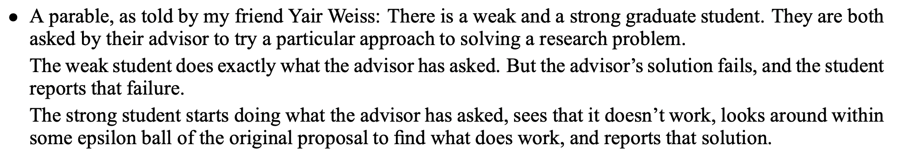
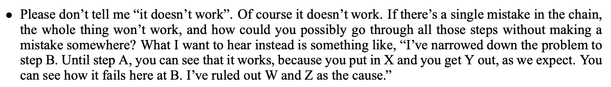
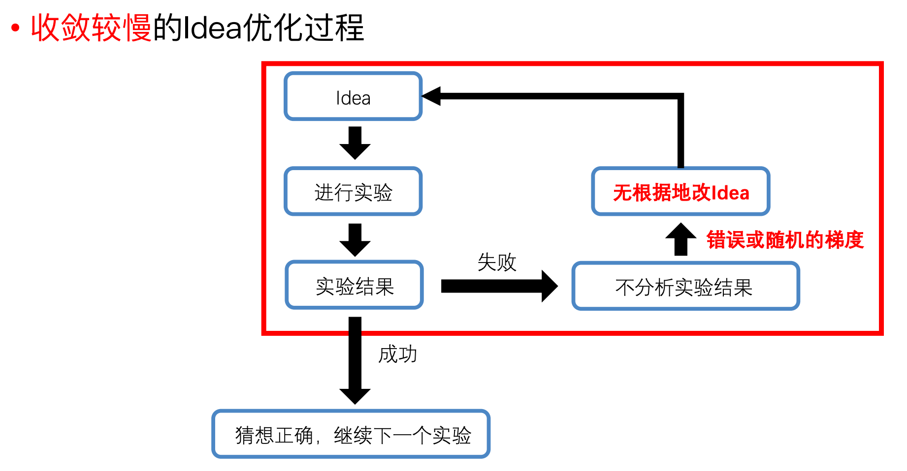
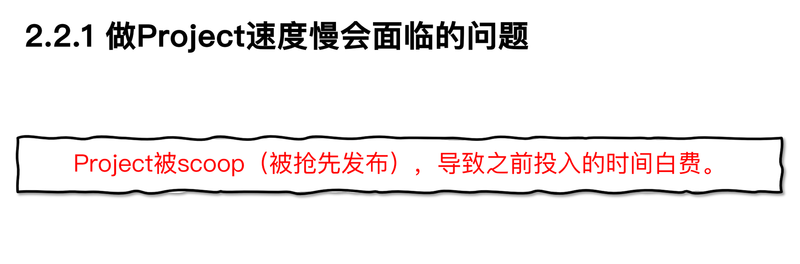
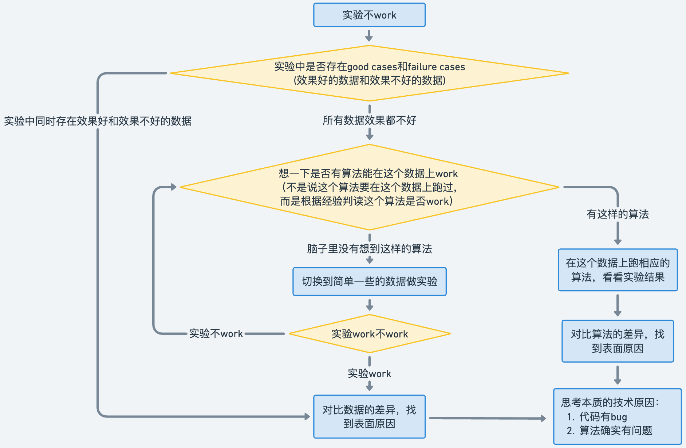
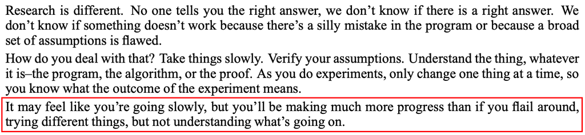

> 本文是 [如何找到实验不work的原因](https://pengsida.notion.site/1aee6e718de6472f834d13da8f4ff097) 在 2026-05-21 的快照，原文档可能在 Notion 上有更新。

> 文档汇总（GitHub Repo）：<https://github.com/pengsida/learning_research>

找到实验不work的原因，才能有效地改进当前的方法。
请注意，本文档的目标不在于提出novel idea，仅限于找到实验不work的原因。

高水平科研工作者谈到，“发现实验不work的原因”是博士生重要的科研能力

<http://people.csail.mit.edu/billf/www/papers/doresearch.pdf>

ALT

<http://people.csail.mit.edu/billf/www/papers/doresearch.pdf>

ALT

不分析实验结果的后果

Project做得很慢，很可能不成功，或者被scoop，导致之前投入的时间白费

如何找到当前实验不work的原因。本文主要总结自高水平科研工作者的[科研教学文档](http://people.csail.mit.edu/billf/www/papers/doresearch.pdf)。

流程图：

文字描述：

搜集当前实验的failure cases（效果不好的实验结果、表面的实验现象）。

搜集当前实验的good cases（效果好的实验结果），或者找到一个能work的实验版本。

如何找到能work的实验版本

有两种做法：

把任务变得简单：实验数据的复杂度（比如：大场景 → 小场景，复杂光照 → 简单光照，复杂材质 → 简单材质）、task setting（比如：泛化 → 拟合，稀疏视角 → 稠密视角，RGB监督 → RGB-D监督，降低数据量）

逐个去掉自己加的算法改进

分析“work的实验版本”和“不work的实验版本”之间存在performance gap的技术原因。（分析good cases和failure cases之间存在performance gap的技术原因）

如果是“work的实验版本”和“不work的实验版本”，要怎么做

在work的实验上逐步加东西，直到变得不work，从而定位导致实验不work的表面原因。

具体做法

有两种做法：

把任务变得复杂。

加算法改进。

一次只加一个因素，找到导致不work的因素（该因素越单一越好）。

高水平科研工作者的经验：As you do experiments, only change one thing at a time, so you know what the outcome of the experiment means.

找到单一的导致不work的因素以后，分析技术原因。列出尽量多的可能性。把这些可能性排个序。

具体做法

可能是代码有bug。

如何检查代码的bug，具体见这个文档：调试九法<https://www.notion.so/pengsida/debug-1b69debf803a4c268fc8a09a9a748bbf>

可以逐行检查代码的输出，验证输出的结果和自己的预期是否一样。可以检查数据的shape，还有可视化代码输出的结果来验证。

这个bug可能是个人对算法的理解不到位，此时需要去看论文或者原理性的东西去理解透彻了再回去检查代码。

可能是算法确实有问题。算法有问题的四种可能：（1）超参没设置对。（2）算法缺了几个tricks。（3）数据不合适。（4）算法本身确实不行。

如何寻找算法的问题

一个有效的方法是看相关的论文为什么可以work，看他们使用了什么tricks。

相关论文指的是使用了相近的方法模块/insight、或者解决相近的technical challenge的论文。

有些很牛逼的算法，单独自己的时候不work，需要加一些tricks才work。（比如NeRF + positional encoding）

这里只能对着实验现象和算法一阵分析原因了。本人暂时没有通用的分析方法。非常建议这里和导师、同学多交流。

如果是“good cases”和“failure cases”，要怎么做

找到good cases和failure cases对应的数据，分析它们的数据特点。是数据上的哪一方面的差异导致了performance gap？

分析数据差异背后的技术原因是什么。列出尽量多的可能性。把这些可能性排个序。

具体做法

可能是代码有bug。

如何检查代码的bug，具体见这个文档：调试九法<https://www.notion.so/pengsida/debug-1b69debf803a4c268fc8a09a9a748bbf>

可以逐行检查代码的输出，验证输出的结果和自己的预期是否一样。可以检查数据的shape，还有可视化代码输出的结果来验证。

这个bug可能是个人对算法的理解不到位，此时需要去看论文或者原理性的东西去理解透彻了再回去检查代码。

可能是算法确实有问题。算法有问题的四种可能：（1）超参没设置对。（2）算法缺了几个tricks，导致在这个数据上不work。（3）算法本身确实不行，导致在这个数据上不work。（4）数据太难了，可以换个简单的数据。

如何寻找算法的问题

一个有效的方法是看相关的论文为什么可以work，看他们使用了什么tricks。

相关论文指的是使用了相近的方法模块/insight、或者解决相近的technical challenge的论文。

有些很牛逼的算法，单独自己的时候不work，需要加一些tricks才work。（比如NeRF + positional encoding）

这里只能对着实验现象和算法一阵分析原因了。本人暂时没有通用的分析方法。非常建议这里和导师、同学多交流。

实验验证上一步中提出的技术原因。一切的猜测最终都要由实验验证。下面是杨植麟做实验的经验。

杨植麟的经验：快速迭代。

杨植麟：其次，我觉得最为重要的一点是，要快速迭代。我们做科研，其实并不是每个想法都正确，我们的 Idea 总会出错，而且大多数人的大多数 Idea 都是不 Work 的。我之前有个规律，就是把我的所有结果都写到Google Spreadsheet 里面，然后就发现每当写四五百行或者1000行，就会有一个 Positive 的结果。所以这就意味着，产出结果的速度，取决于你迭代的速度，你要迭代的足够快，才有可能快速地出结果。所以我觉得这是一个很重要的经验。

请注意，快速迭代建立在有效实验的基础上。盲目的做实验可能让事情变得更糟。

高水平科研工作者对“有效实验”与“盲目实验”的讨论

Once you’ve ruled out the impossible, whatever remains, however improbable, must be true。排除所有不可能的因素之后，无论剩下的多么难以置信，那就是真相。

针对导致failure cases的技术原因，提出解法。（需要建立自己的武器库，知道学术界都有哪些技术。可以通过[构建literature tree](/f8b36e484b344a2893a94e4608b72ec2?pvs=25)来帮助建立武器库。）

要经常性地确认自己在正确的方向上：当前的算法思路真的对吗。要避免陷入local minima。建议经常找同学交流讨论。

参考材料：

How to do research.pdf

140.9KB

杨植麟的科研经验.pdf

2567.3KB
