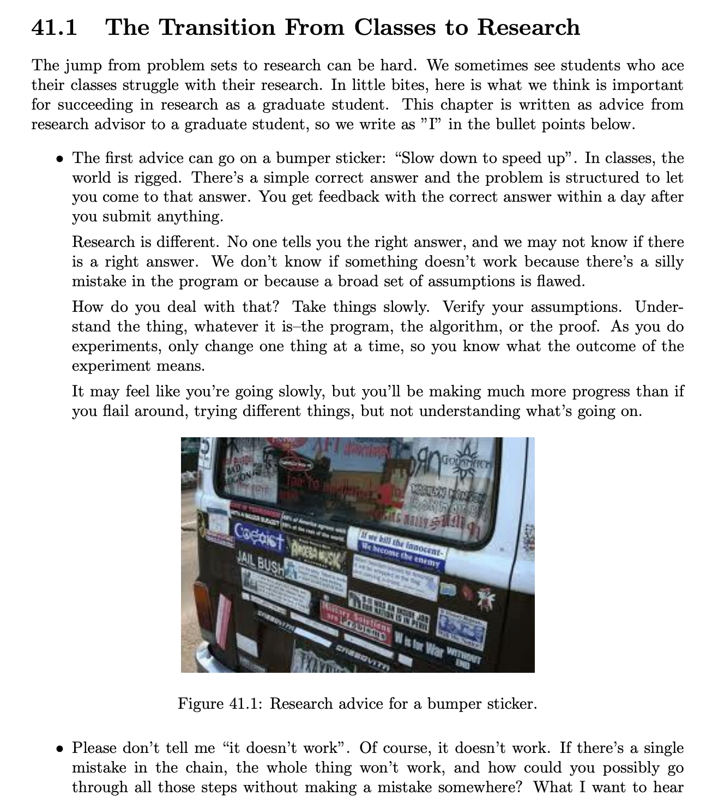
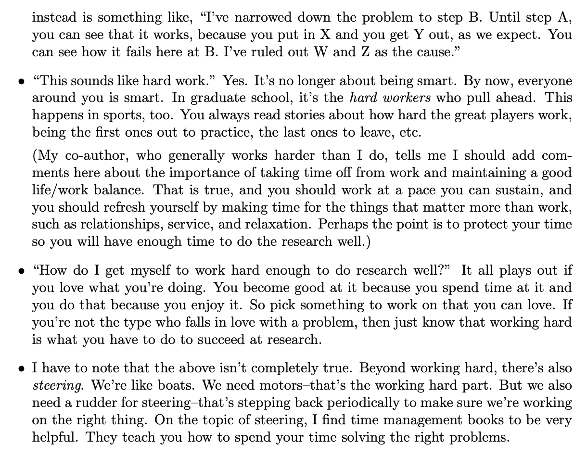
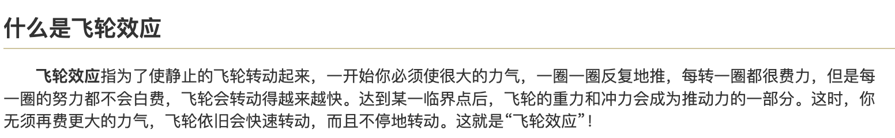
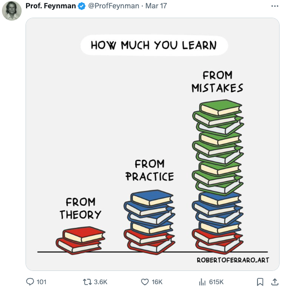
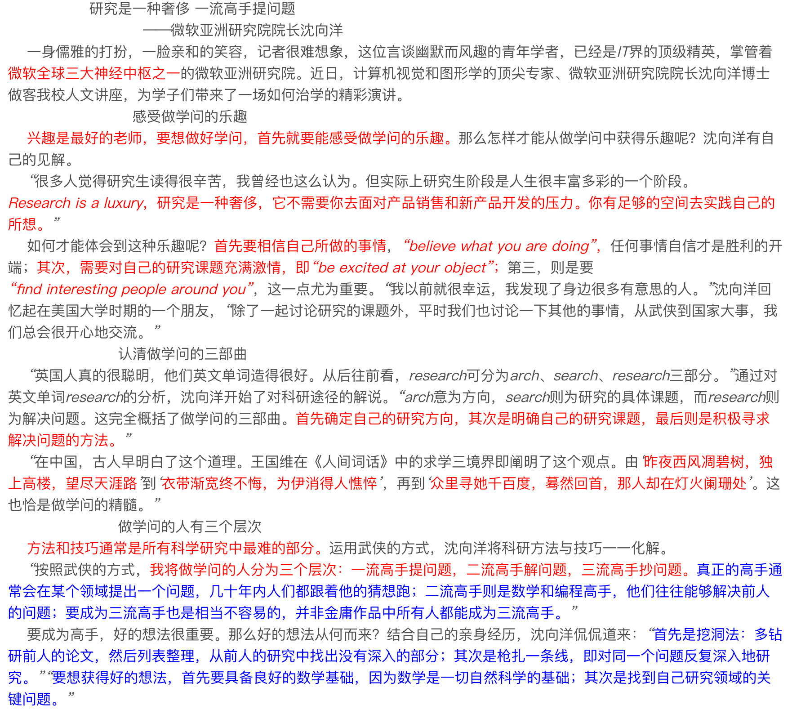

> 本文是 [科研学习与课程学习的不同之处](https://pengsida.notion.site/a3fe9f17b8af46558cd1112627009c83) 在 2026-05-21 的快照，原文档可能在 Notion 上有更新。

> 文档汇总（GitHub Repo）：<https://github.com/pengsida/learning_research>

本文主要总结自高水平科研工作者的科研教学文档

科研与课程的学习方式不同之处1

课程学习可能会让人养成一个习惯：把一门课学完了，再来用课程知识做作业。

科研学习是边学算法、边用算法，在使用算法中学习算法。要善用ChatGPT。（类比课程学习就是，没学课程知识前，直接上手写作业，然后查着课程内容来做作业。GPT是一个超级检索器。）

科研与课程的学习方式不同之处2（重要）

课程学习中，因为课程要求我们不能抄答案、尽量一个人完成作业，可能会养成自己一个人把一个问题/算法琢磨清楚的习惯。
而科研学习中，要善用各种资源来帮助自己高效学习，从各种地方蒸馏知识。详见这个文档：<https://www.notion.so/pengsida/903b997097d343dbaba6d5e0780eab0f>

科研与课程的不同之处3

课程学习需要相互竞争：

课程打分有个很烦的一点，就是正态分布，每个班只有前百分之几的人可以拿到90以上。

这样的设置，导致高分资源是有限的。班内的同学需要内卷，不断提升自身水平，超过其他人，才能拿到高分资源。

科研学习不需要相互竞争：

科研是自己做自己的论文，是在创造新的价值，而不是争取某些有限的资源。

Research Project是自己去构思、去探索的。而不是已经预先设定好、价高者得的东西。

请不要把内卷意识、竞争意识带到实验室。科研倡导相互合作、相互交流。

科研与课程的不同之处4：知识体系

课程学习中，知识体系一般非常完善，有很好的教材、教程，要需要学习的知识点都整理好了，一步一步学习就行。

科研学习中，因为学的东西比较前沿，所学知识点都很散。即使网上有教程，也很可能梳理地不好，无法直接呈现自己所需的知识。如果通过上课、看书学习前沿科研涉及的知识点，往往需要学习大量额外的不相关内容。

科研学习中，实验室的导师、学长学姐就是行走的完整知识体系。
高绩点的本科大佬们，平时怎么查询教材教程，就把导师、学长学姐当作教材教程，进行询问、学习吧！

科研与课程的不同之处5：解决问题时的心理准备

科研与课程学习的区别很大。

课程学习：课程问题总可以有一个答案，而老师已知答案，他可以把课程变得结构化，帮助我们一步一步去获得答案。

科研：在这个问题上，我们自己很可能是懂得最多、思考得最深入的人，超过自己的导师。导师不知道正确解法，只能和你一起探索。

这个事实意味着自己要独立解决问题。

做实验时的心理准备

和课程学习不同，课程学习中做作业往往只会出错几次，而科研实验很可能失败几十次以上。大多的科研成果是通过大量失败的实验迭代得到的。

如果实验失败，不能像课程学习一样简单地说该解法不work，然后直接换个解法。科研要求分析当前实验不work的原因。

要变得敢于失败，并从失败的实验结果中分析不work的原因，从而改进当前的解法。

做好经常交流讨论的准备

课程学习中，一个人独自学习是没问题的，因为课程内容设置好了，跟着走就行。

科研中，没有明确的正确道路。我们不确定自己是不是对的，因为我们要经常和他人交流自己的想法。

想解决方案时和课程学习的不同

做课程学习中的作业，通常要求不能看答案，最好是自己完全不借助外部工具去解题。

而科研有很大的不同。

科研中，在想解法时，需要先去摸巨人的肩膀。看看存不存在已有的算法能解决这个问题，再看有没有相近的算法能解决这个问题。

research，先search，再re-search。搜索相近算法的能力非常重要。
杨植麟认为：技术的本质就是对方法做组合，把小的技术组合成大的技术，把老的技术组合成新的技术。

知识学习一开始可能很难，但坚持下来，就能见识到人本身的飞轮效应

费曼传授科研中的真理：

参考材料：

沈向洋老师的科研经验

How to do research.pdf

140.9KB

众多高水平科研工作者认为的一个Top Ph.D. student所需要的品质.pdf

15968.7KB
