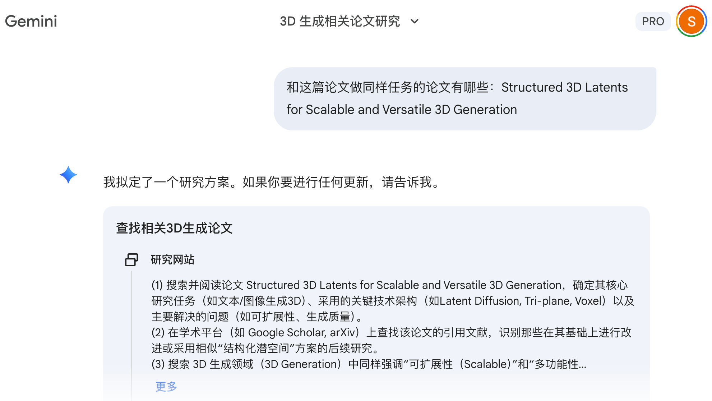
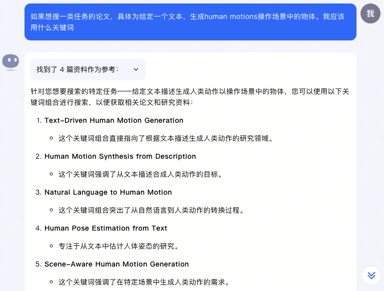
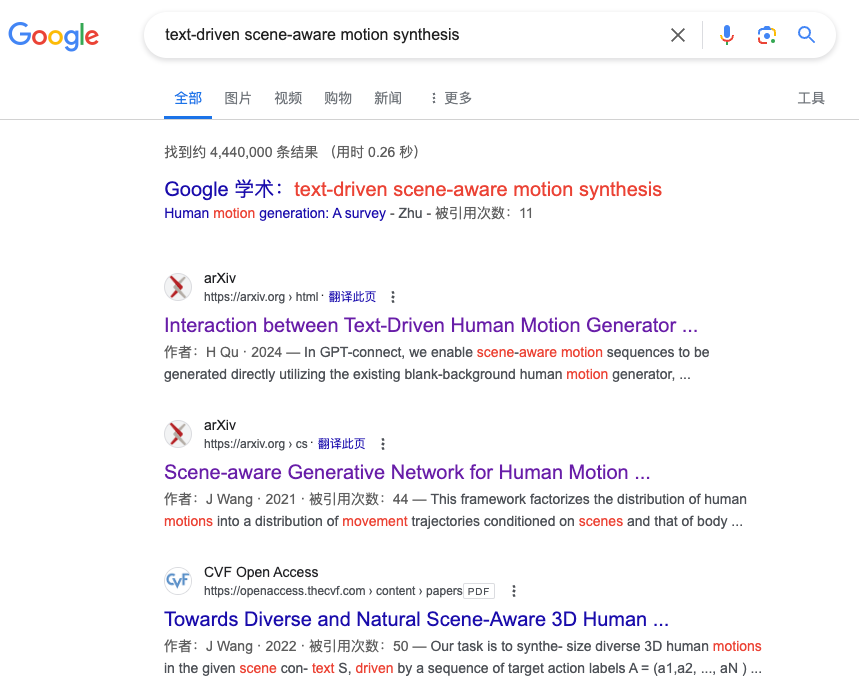
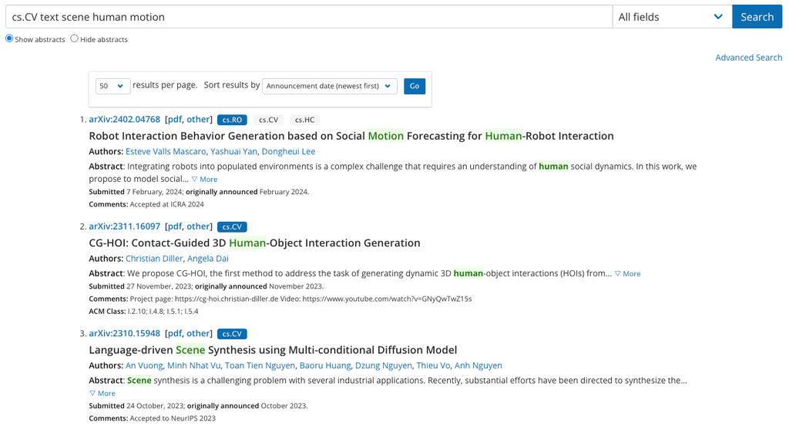

> 本文是 [怎么找论文](https://pengsida.notion.site/c278dab7e4764d61a92c1fd1ef3135b1) 在 2026-05-21 的快照，原文档可能在 Notion 上有更新。

使用Deep Research找论文，非常简单易用：

过时方案（2026.01之前）

基于AI的论文搜索网站：<https://www.wispaper.ai/scholar-search/>

问kimi相关论文的搜索关键词，然后在Google和arxiv上搜索。下面是个例子：

问kimi推荐论文

平时积累相关领域的研究人员，看看他们有没有做相关的工作

平时积累相关领域的论文

找到相关的论文后，查看该论文引用的论文以及引用该论文的论文，从而找出更多相关论文
