> 本文是 [如何做学术报告slides](https://pengsida.notion.site/slides-810f02670691444f8c94cc3d5b76dcbc) 在 2026-05-21 的快照，原文档可能在 Notion 上有更新。

> 文档汇总（GitHub Repo）：<https://github.com/pengsida/learning_research>

做报告slides前，先回答几个问题：
1. 要讲哪几个工作。这些工作需要在解决同一个科研方向的问题。
2. 这些科研工作解决了该科研方向的哪些问题。
3. 如何通过介绍related work引出这些问题。（需要一次性引出全部的问题）

做学术报告slides的思路：

介绍科研目标

介绍研究方向的应用

通过讨论related work介绍面临的挑战（类似introduction）

related work 1

related work 1面临的挑战

related work 2解决了上述挑战

related work 2面临的新的挑战（该talk中的工作所解决的挑战）。放一页slides，总的呈现这个talk内容解决的技术挑战

总的呈现该报告的内容

介绍第一个内容

任务设定

介绍面临的挑战

解决问题的核心思想

我们的方法

实验结果

介绍第二个内容

…

总结

未来工作的展望

需要整理的材料

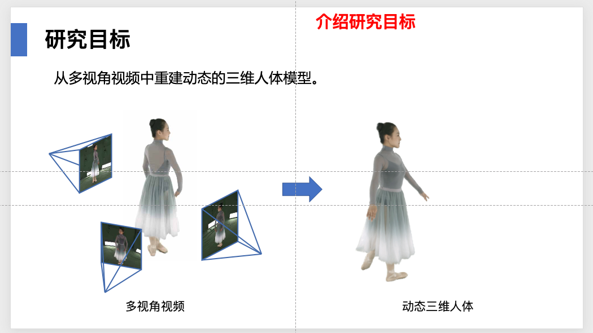

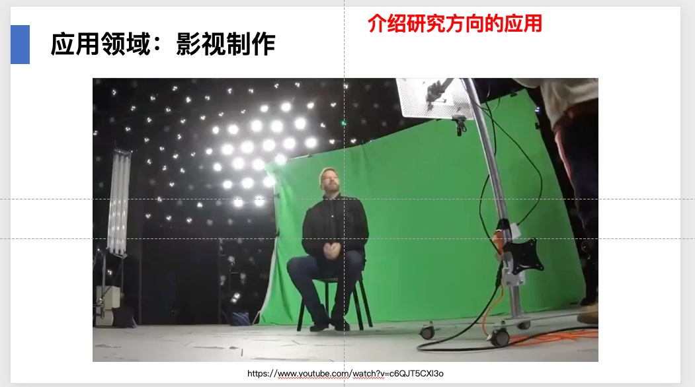

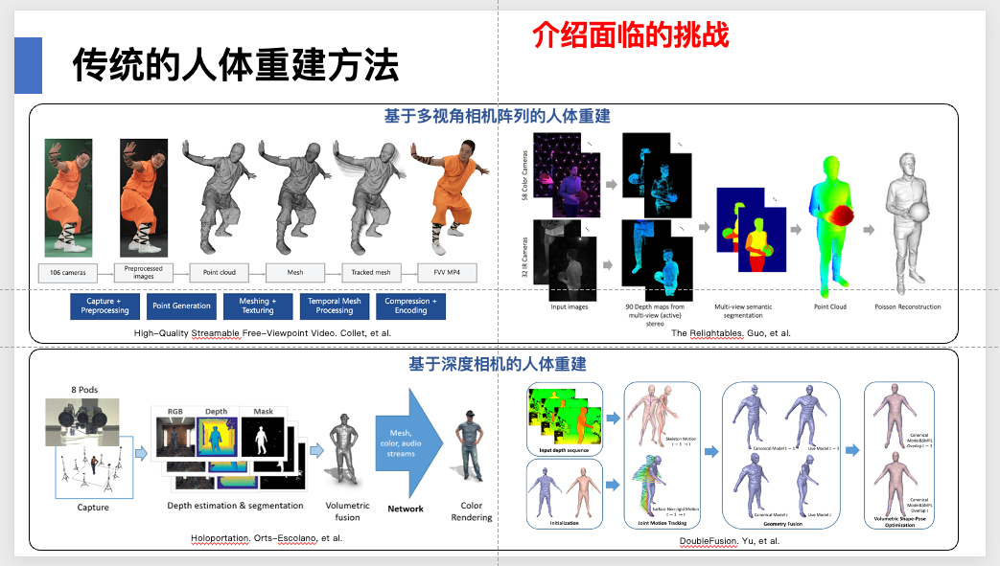

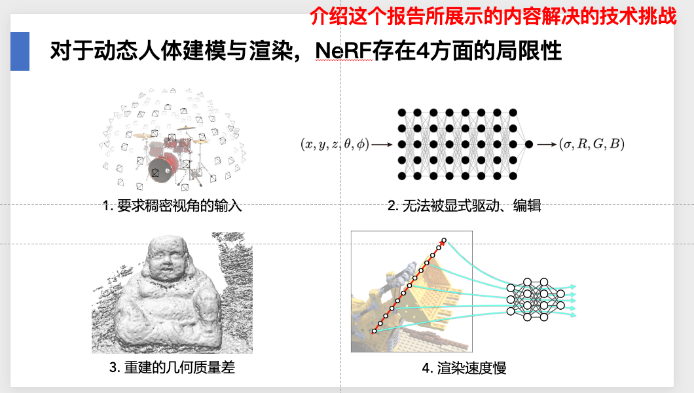

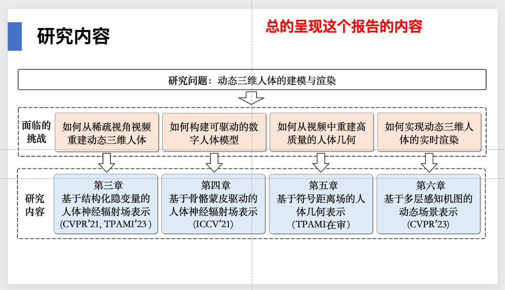

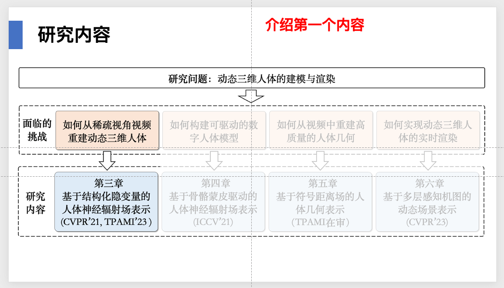

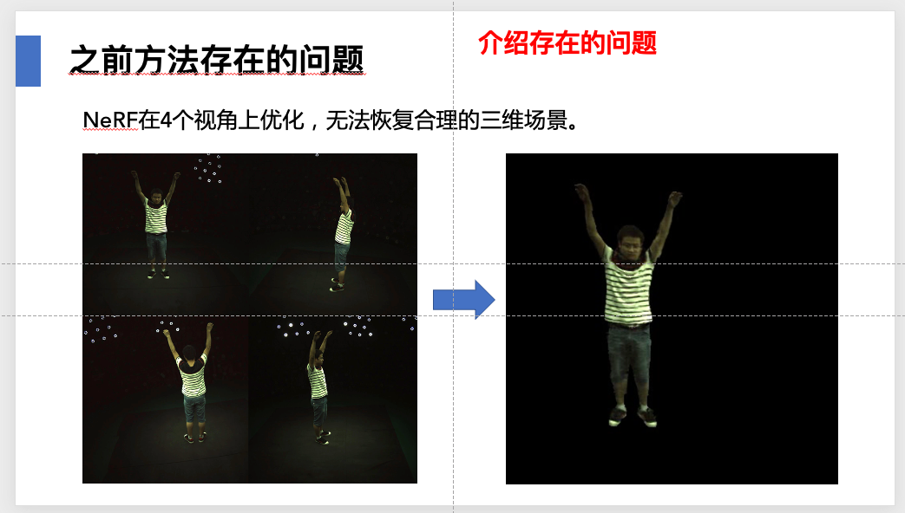

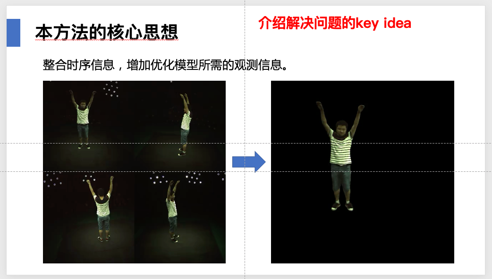

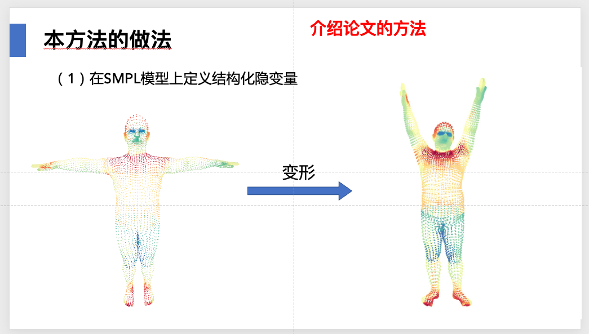

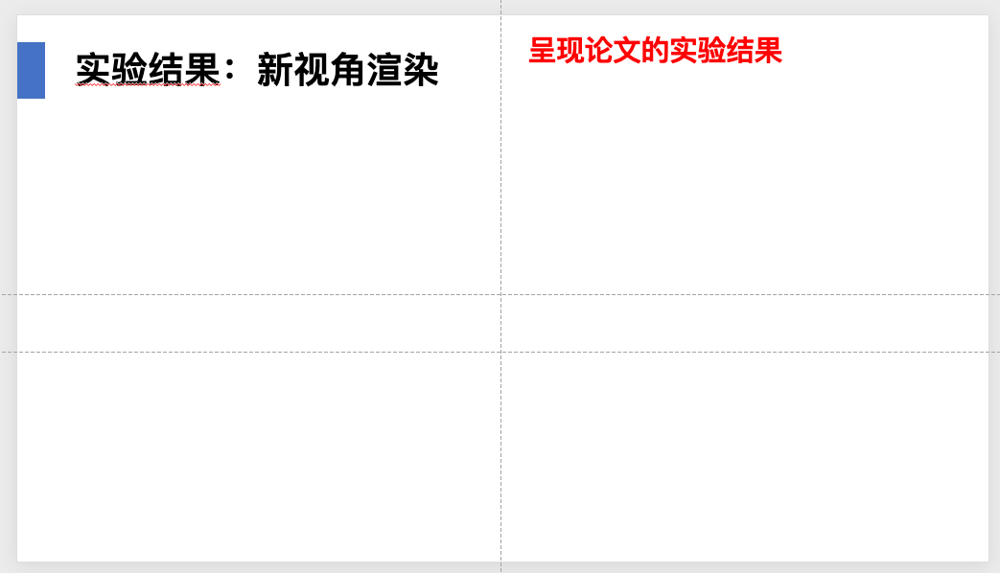

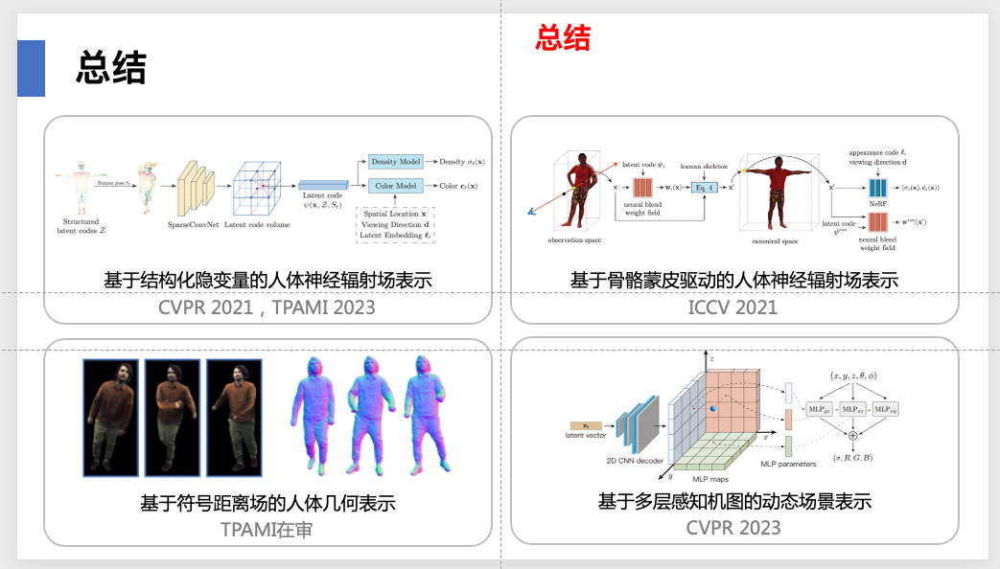

PPT使用技巧和美感设计

学会使用PPT母版

PPT学习：<https://www.notion.so/pengsida/PPT-f1e4f77f0f3943e39dd1210bd3fe71ea>

学术报告slides模板：<https://alidocs.dingtalk.com/i/nodes/QOG9lyrgJPwBpdn0u1bOA6m2VzN67Mw4>（钉钉脑图。钉钉文档的分享机制不支持直接对外分享，需要另外申请权限）

另一个做学术报告的思路

先从应用场景讲起，挖掘出其中的研究目标，然后讲研究内容，最后讲科学问题。

区别于先讲研究目标再讲有什么应用。
这种报告的风格是专注于某个应用场景，然后挖掘其中的研究目标和研究内容。
