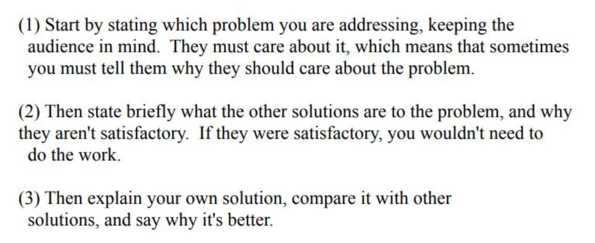
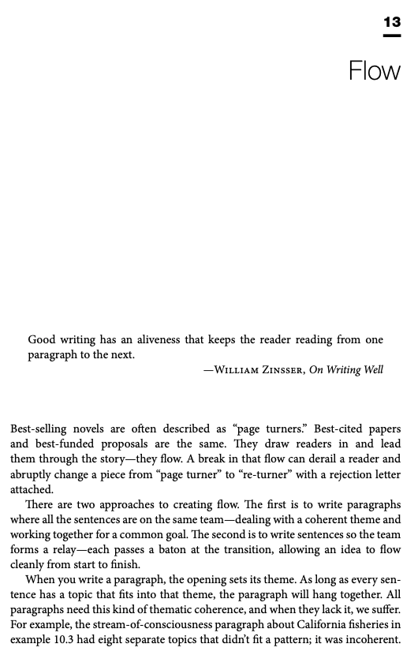

> 文档汇总（GitHub Repo）：<https://github.com/pengsida/learning_research>

Bill Freeman的经验

how\_to\_write\_a\_good\_CVPR\_submission.pdf

4322.3KB

SIGGRAPH Paper chairs论文的经验

paper\_chairs\_writing.pdf

63.0KB

英语写作非常重要的是flow，包括paragraph flow和sentence flow

英文写作的神书: Writing science，里面有一节介绍了flow。

Writing\_Science.pdf

1525.4KB

怎么判断writing是不是flow的

does-my-writing-flow.pdf

198.6KB