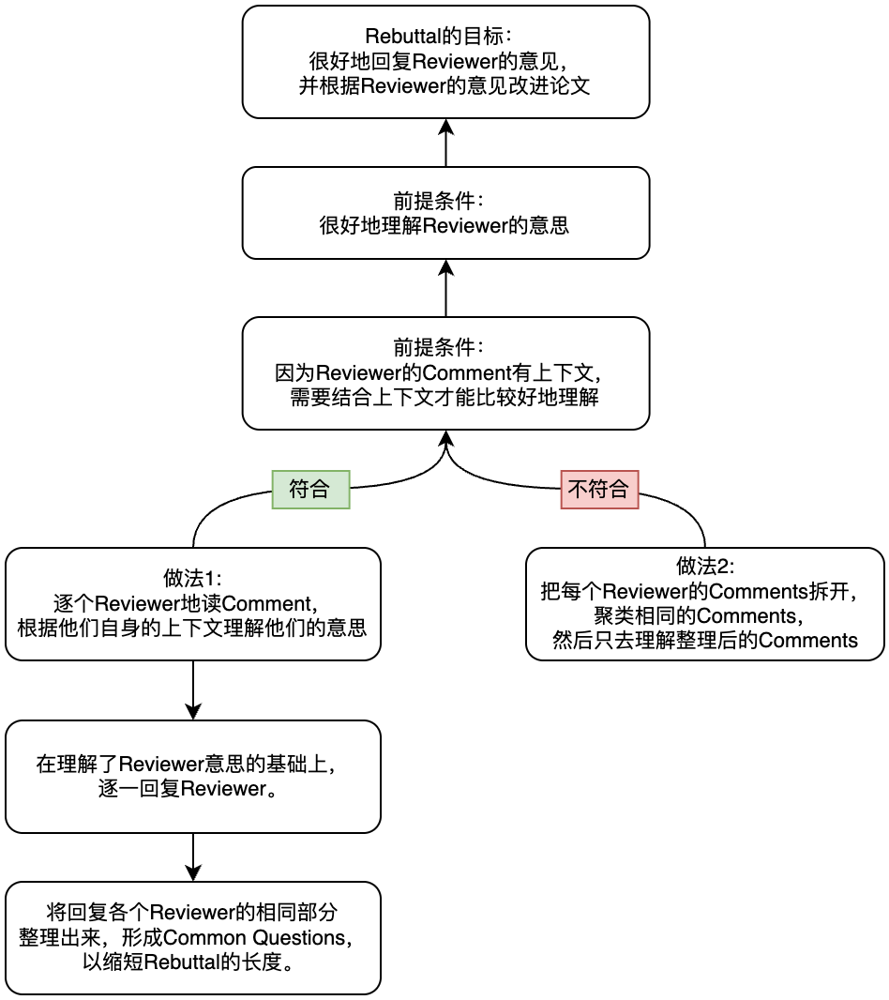

> 文档汇总（GitHub Repo）：<https://github.com/pengsida/learning_research>

Rebuttal的语言风格：

问啥答啥。不要扯其他的东西，这样会分散Reviewer的注意力。

把Reviewer问的东西放在段落最前面。

尽量按Reviewer问题的顺序回答Reviewer。

尽量在每个Reviewer Section下列出Reviewer的所有问题，然后一一回复。即使是有Common Questions，也是在Reviewer Section下Refer to Common Questions。

上述语言风格的例子可参考该文件：

Rebuttal语言风格示例.pdf

1 MiB

Rebuttal具体流程：

首先整理review的内容

新版review整理工具，基于drawio整理（推荐，更有全局观，更方便阅读）：

Rebuttal整理模板.drawio

32.6 KiB

基于Excel的review整理工具

<https://docs.google.com/spreadsheets/d/1TS2l5SrbExHxA1i_xrm2Sbd5dz_uS4CqAjoAskiZNX0/edit?usp=sharing>

以下空白的review整理模板：

<https://docs.google.com/spreadsheets/d/17sH8sMqroFrmLKfogcC-9AyJpWKi8Ugru1NoKtFAIDo/edit?usp=sharing>

回答清楚这个问题：为什么reviewer给出当前这个分数？

然后回答justification和weaknesses里提出的问题

这是写rebuttal的教学文章：

<https://deviparikh.medium.com/how-we-write-rebuttals-dc84742fece1>

<https://research.siggraph.org/blog/guides/writing-a-rebuttal-for-siggraph/>

rebuttal的语言风格：正面回答reviewer的问题，让reviewer一读就知道我们在回答他的什么问题。
一般要遵从的原则：
1. reviewer要啥，我们就给啥。
2. 不要在回答里面引入新问题。（不然很容易因此挂掉）

写完rebuttal的初稿后，标记每个reviewer的重点问题 (一般会在justification里给出)，反复确认是否正确回答了reviewer的问题，是否能convince reviewer。也找同学看看自己是否合理地回答了reviewer的重点问题。

为什么只标记重点问题：因为每个reviewer一般只会有几个主要关心的点。有些reviewer会写很多内容，但多了以后他们自己也记不住，久了就忘记了。review里有一两个关键的点他们是能牢牢记住的，也是他们最关心的。
当然，reviewer的每个问题都得好好回答。只是说写完rebuttal初稿后，要把大部分精力集中在确认那一两个问题上，也找几个同学确认一下这些问题自己是否回答正确。