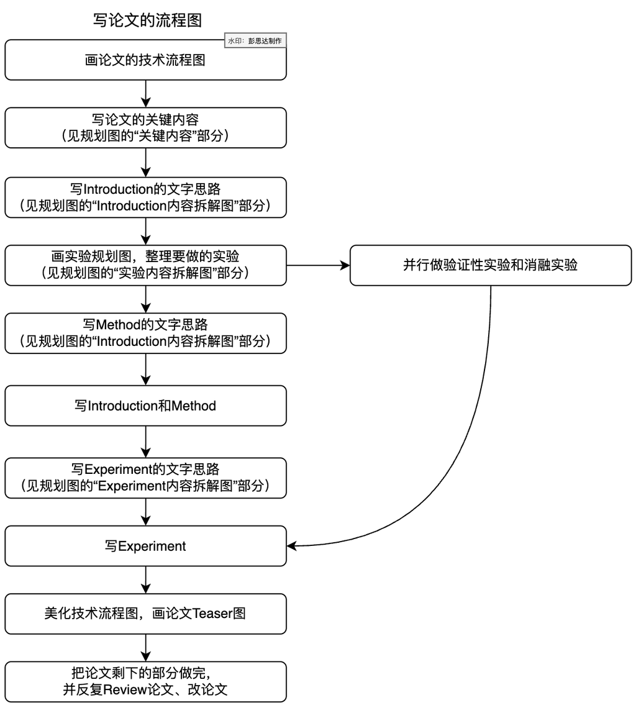
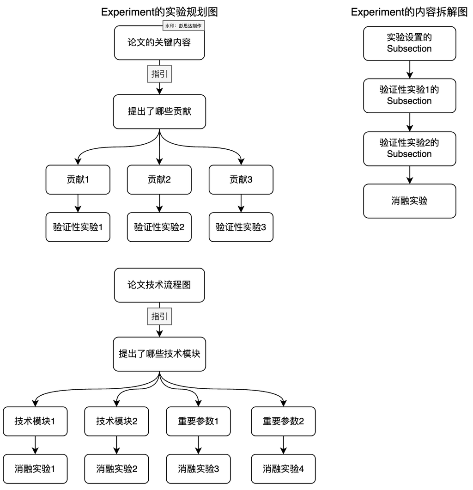
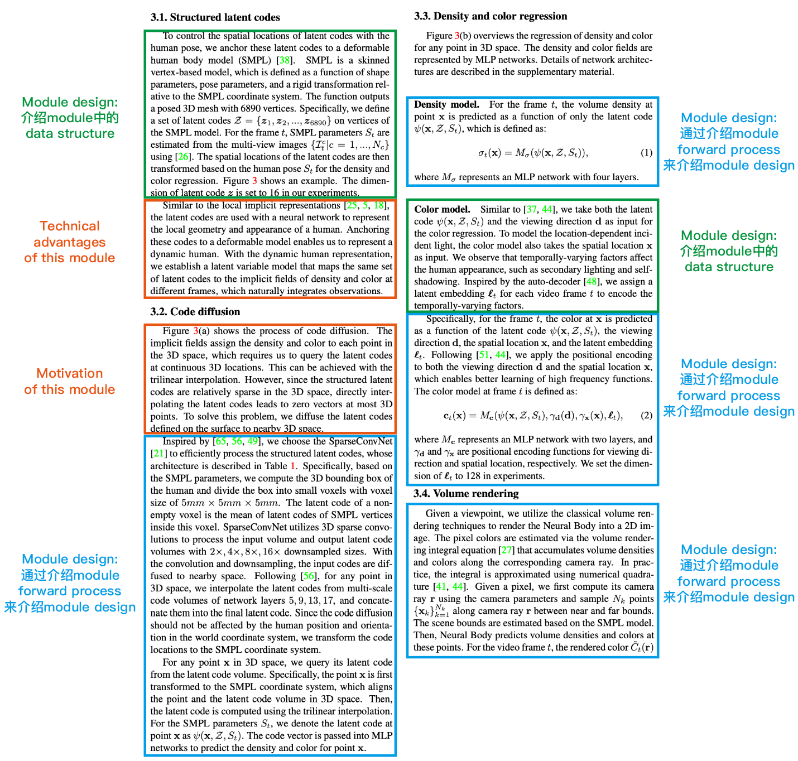
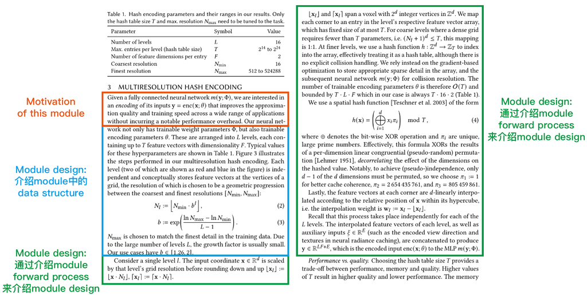
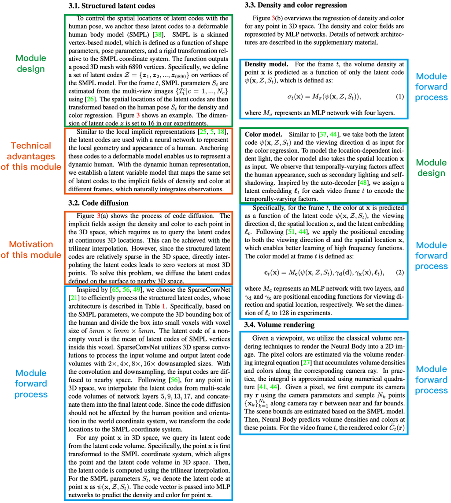
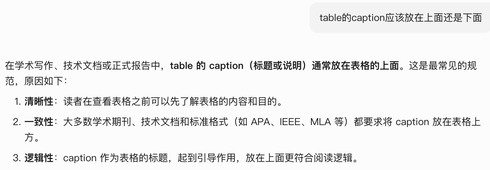
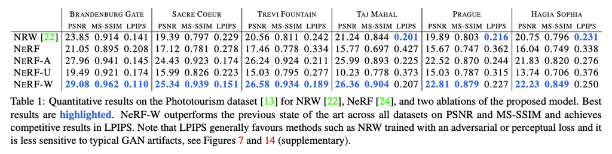
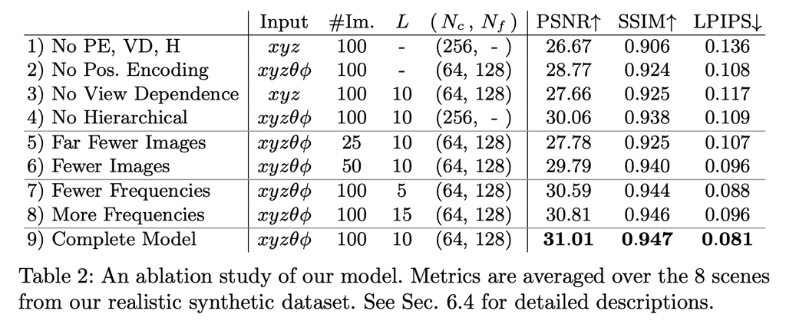
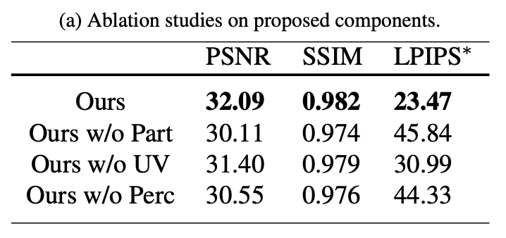
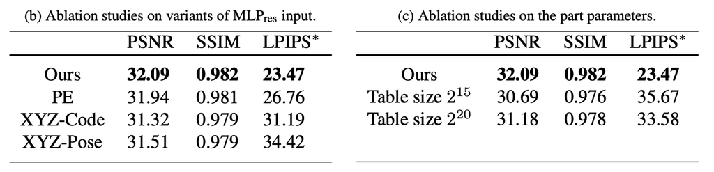

> 文档汇总（GitHub Repo）：<https://github.com/pengsida/learning_research>

将本写作模板转为Vibe Writing Skills的仓库：<https://github.com/Master-cai/Research-Paper-Writing-Skills>

论文写作规划图

论文写作规划.drawio

46.5 KiB

| 写论文步骤 | 相应的教程 |
| --- | --- |
| 1. 画一个清楚的pipeline figure的草图 | a. [论文画图模板（未对外公开）](/0051678d2df74d73ae236b9b44875193?pvs=25) |
| 2. 梳理论文的story，写一个Introduction的写作思路，并整理要做的comparison experiments和ablation studies | a. [如何梳理论文Story](/c1a22465a0fa4b15a12985223916048e?pvs=25#e9ac9d2730e244b09ff448bc90db7378) b. [如何列写作思路](/1143fe292ff180feb5d0fe76d05e085b?pvs=25) c. [如何整理要做的实验](/c1a22465a0fa4b15a12985223916048e?pvs=25#b0e7940f3b8b4a3e951ec672eaf4632e) |
| 3. 列Method的写作思路，然后写Method，同时做实验 | a. [如何写Method](/c1a22465a0fa4b15a12985223916048e?pvs=25#7a54f95f28334ff7b6b6912fd48566dd) b. [如何列写作思路](/1143fe292ff180feb5d0fe76d05e085b?pvs=25) c. [如何使用copilot和gpt辅助英语写作](/1143fe292ff180feb5d0fe76d05e085b?pvs=25) |
| 4. 改Introduction和Method，同时做实验 | a. [如何改论文写作](/1293fe292ff180bfa5deeed526821d78?pvs=25) |
| 5. 实验做差不多以后，列Experiment的写作思路，然后写Experiment | a. [如何列写作思路](/1143fe292ff180feb5d0fe76d05e085b?pvs=25) b. [如何使用copilot和gpt辅助英语写作](/1143fe292ff180feb5d0fe76d05e085b?pvs=25) c. [如何画实验表格](/c1a22465a0fa4b15a12985223916048e?pvs=25#13d3fe292ff18085ac3ae97c82c431dc) |
| 6. 美化pipeline figure，画论文teaser图 | a. [论文画图模板（未对外公开）](/0051678d2df74d73ae236b9b44875193?pvs=25) |
| 7. 列Related work的写作思路，然后写Related work | a. [如何写Related work](/c1a22465a0fa4b15a12985223916048e?pvs=25#5bdde0c289ef4f248a44247e2e0db685) b. [如何列写作思路](/1143fe292ff180feb5d0fe76d05e085b?pvs=25) c. [如何使用copilot和gpt辅助英语写作](/1143fe292ff180feb5d0fe76d05e085b?pvs=25) |
| 8. Review论文。改论文的Introduction、Method和Experiment | a. [如何Review论文](/c1a22465a0fa4b15a12985223916048e?pvs=25#4559fe4c3acd463983a11f9140994c3d) b. [如何改论文写作](/1293fe292ff180bfa5deeed526821d78?pvs=25) |
| 9. 列Abstract的写作思路，然后写Abstract | a. [如何写Abstract](/c1a22465a0fa4b15a12985223916048e?pvs=25#4a2e8630072c4ff4a7350a81ed90fd56) b. [如何列写作思路](/1143fe292ff180feb5d0fe76d05e085b?pvs=25) c. [如何使用copilot和gpt辅助英语写作](/1143fe292ff180feb5d0fe76d05e085b?pvs=25) |
| 10. 取论文标题 | a. [如何取论文标题](/c1a22465a0fa4b15a12985223916048e?pvs=25#90f8fc1e49404621bda346f978d8b690) |
| 11. 反复review论文，改论文 | a. [如何Review论文](/c1a22465a0fa4b15a12985223916048e?pvs=25#4559fe4c3acd463983a11f9140994c3d) b. [如何改论文写作](/1293fe292ff180bfa5deeed526821d78?pvs=25) |

论文收获好review的关键：把论文做得漂亮、美观，让人第一印象觉得这篇论文很高级。
怎么让论文第一眼看起来很漂亮、高级：
1. 好看的teaser figure、pipeline figure。
2. 好看的表格和结果图。
3. 整齐的排版。

段落写作原则：
1. 一段文字只讲一个Message，并表达清楚，不要把几个Messages杂糅在一起。
2. 一段文字开头第一句就要让读者知道这段在说什么。
英语写作的基本思路：先列写作思路，然后细化每一部分的思路，再写具体的英语句子。注意段落、句子之间的flow。（flow的概念具体看这个[文档](/74aef88b9187439fa4e301704f6eb49a)。）
写论文一定要“如切如磋，如琢如磨”，反复品味，揣摩读者是否读得懂。
“自我评阅论文写作是否清楚”的能力非常重要。知道有问题才能知道要改。

写论文的关键

理清楚写作思路，再动手写。

如切如磋，如琢如磨，反复修改写作思路和英语句子。

如何判断论文段落的写作是否清楚（重要）

does-my-writing-flow.pdf

198.6KB

从读者的角度读论文段落。有几点可以检查的：

这一个段落是否有一个明确的主题？

段落的第一句话是否讲清楚了这一段要说什么。

句子中的每一个名词（概念），读者是否能读懂。是否能实现self-contained。

什么情况下，读者会读不懂句子中的名词

两个句子之间的逻辑，是否连续。

什么情况下，两个句子的逻辑是不连续的

Reverse-outlining。根据已经写出的段落列出该段落的写作思路，看看思路是否通顺。

[如何使用copilot和gpt辅助英语写作](/1143fe292ff180feb5d0fe76d05e085b?pvs=25)（重要，LLM时代的基本技能）

[如何改一篇论文的写作](/1293fe292ff180bfa5deeed526821d78?pvs=25)

什么时候要开始写论文：一般情况下，至少要在截稿时间一个月前就开始写论文。

论文写作的关键时间点（从截稿时间一个月前开始计划）

截稿时间一个月前，很可能没有把论文method完全定下来，也没有把实验全部做完。但基本会把论文的story定下来了，因此可以开始写论文、开始规划要做哪些事情。

提前一个月写论文，能节约后面做论文的时间，让自己做论文轻松一些，也能帮助自己思考做什么实验。

| 时间点 | 论文要写的内容 |
| --- | --- |
| 截稿时间四周前 | 1. 整理现有的story，包括core contribution、方法的各个模块及其motivation。 2. 列出要做的comparison experiments和ablation studies。 3. 这一周写一个introduction的初稿。 |
| 截稿时间三周前 | 这一周最好能把方法定下来。 1. 把pipeline figure的流程图草图画清楚，定下来。 2. 确认好pipeline figure以后，写一个method的初稿。这一周至少method框架定下来了，所以可以把method开始写起来。如果方法的细节还没定下来，就在相应的地方写给\todo{}，先空着，至少把method的框架写出来。 这周截止，必须把introduction和method的初稿给导师改，不然导师很可能改不完论文（想象一下，导师最后几天开始改十篇非常不完整的论文，是什么样的地狱体验。如果自己面对这种情况，会是什么心情）。 |
| 截稿时间两周前 | 这一周把experiments, abstract, related work写一个初稿。 |
| 截稿最后一周 | 改论文、美化pipeline figure和teaser、做demo |

使用投稿进度表管理Projects

记录实验室的总的投稿进度表，这样能知道还有多少论文需要改，从而能知道到达某个时间点，导师将改不完论文。

| Project lead | Introduction | Method | Experiments | Related work | Abstract |
| --- | --- | --- | --- | --- | --- |
| xxx | 描述具体进展 |  |  |  |  |
| xxx |  |  |  |  |  |
| xxx |  |  |  |  |  |
| xxx |  |  |  |  |  |
| xxx |  |  |  |  |  |

论文标题

标题很重要，因为不同的标题很可能会吸引不同领域的reviewers。

起标题前，要先写下一些重要的关键词，然后根据这些关键词起标题。

标题和论文方法短语要有具体的含义，要informative，才容易让读者记住。Informative包括：使用的技术、论文的任务、论文解决的问题。

Abstract

怎么写出好的abstract：(1) 想abstract的写作思路。(2) 套下面的写作模板。(3) 反复改abstract。
关键是写之前先逐个回答下面的问题：
(1) 我们解决的技术问题是什么，这个问题为什么不存在well-established solution（重要）。
(2) 我们的technical contribution是什么。
(3) 我们方法本质上能work的原因是什么。
(4) 我们方法的technical advantage是什么，我们的新认知是什么（重要）。

版本1，介绍technical challenge，再一两句话介绍解决challenge的technical contribution

\section{Abstract}
% Task
% Technical challenge for previous methods (围绕我们解决了的technical challenge展开讨论)
% 一两句话介绍解决challenge的technical contribution (一般就提到xxx技术的名词，不会讲具体的每个步骤。这个名词要让人读得懂，不要有jump的感觉。这个能力对写好abstract很重要。)
% 介绍technical contribution的好处
% Experiment

​

版本2，介绍technical challenge，再一两句话介绍解决challenge的insight，再一句话介绍实现insight的technical contribution。(个人比较推荐这个写法)

\section{Abstract}
% Task
%% 例子1: In recent years, generative models have undergone significant advancement due to the success of diffusion models.
%% 例子2: This paper addresses the challenge of novel view synthesis for a human performer from a very sparse set of camera views.
% Technical challenge for previous methods (围绕我们解决了的technical challenge展开讨论)
%% 例子1: The success of these models is often attributed to their use of guidance techniques, such as classifier and classifier-free methods, which provides effective mechanisms to tradeoff between fidelity and diversity. However, these methods are not capable of guiding a generated image to be aware of its geometric configuration, e.g., depth, which hinders the application of diffusion models to areas that require a certain level of depth awareness.
%% 例子2: Some recent works have shown that learning implicit neural representations of 3D scenes achieves remarkable view synthesis quality given dense input views. However, the representation learning will be ill-posed if the views are highly sparse.
% 一句话介绍解决challenge的insight
%% 例子1: To address this limitation, we propose a novel guidance approach for diffusion models that uses estimated depth information derived from the rich intermediate representations of diffusion models.
%% 例子2: To solve this ill-posed problem, our key idea is to integrate observations over video frames.
% 一两句话介绍实现insight的technical contribution (一般就提到xxx技术的名词，不会讲具体的每个步骤。这个名词要让人读得懂，不要有jump的感觉。这个能力对写好abstract很重要。)
%% 例子1: To do this, we first present a label-efficient depth estimation framework using the internal representations of diffusion models. At the sampling phase, we utilize two guidance techniques to self-condition the generated image using the estimated depth map, the first of which uses pseudo-labeling, and the subsequent one uses a depth-domain diffusion prior.
%% 例子2: To this end, we propose Neural Body, a new human body representation which assumes that the learned neural representations at different frames share the same set of latent codes anchored to a deformable mesh
% 介绍technical novelty的好处
%% 例子2: so that the observations across frames can be naturally integrated. The deformable mesh also provides geometric guidance for the network to learn 3D representations more efficiently.
% Experiment

​

版本3，存在多个technical contributions，分别描述technical contribution的和technical advantage

% Task
%% This paper introduces a novel contour-based approach named deep snake for real-time instance segmentation.
%% Unlike some recent methods that directly regress the coordinates of the object boundary points from an image
% 一句话介绍technical contribution和technical advantage (这个能力对写好abstract很重要。)
%% deep snake uses a neural network to iteratively deform an initial contour to match the object boundary, which implements the classic idea of snake algorithms with a learning-based approach.
% 一句话介绍technical contribution和technical advantage
%% For structured feature learning on the contour, we propose to use circular convolution in deep snake, which better exploits the cycle-graph structure of a contour compared against generic graph convolution.
% 一句话介绍technical contribution和technical advantage
%% Based on deep snake, we develop a two-stage pipeline for instance segmentation: initial contour proposal and contour deformation, which can handle errors in object localization.
% Experiment

​

Introduction

怎么写出好的introduction：(1) 想introduction的写作思路。(2) 套下面的写作模板。(3) 反复改introduction。
怎么想Introduction的写作思路：倒推，然后正推。
首先倒推，逐个回答下面的问题。
(1) 我们解决的技术问题是什么，这个问题为什么不存在well-established solution（重要）。
(2) our pipeline的contributions是什么 (比如，提出新的有价值的任务、 提出新的有价值的技术指标、 提出新的技术问题、提出新的技术)。
(3) 我们contributions的好处是什么，为什么能解决了这个technical challenge，带来了什么新的认知（重要）。
(4) 怎么通过写之前的方法引出我们解决了的technical challenge、引出我们的新认知。
然后正推，列出论文story：
(1) 介绍论文的Task。
(2) 通过讨论之前的方法引出我们解决了的technical challenge。
(3) 为了解决这个technical challenge，我们提出了xx contributions。
(4) 我们contributions的技术优势是什么，表达我们的新认知（重要）。

\section{Introduction}
% Task and application
% Technical challenge for previous methods (围绕我们解决了的technical challenge展开讨论。Technical challenge包括limitation和technical reason)
% 介绍解决challenge的our pipeline
% Experiment
% Contributions

​

介绍Task和application

版本1: Task比较小众，先介绍Task，再介绍Application

% 介绍Task (如果task很熟悉，可以直接跳过)
%% 例子：Object pose estimation aims to estimate object's orientation and translation relative to a canonical frame from a single image.
[xxx task] targets at recovering/reconstructing/estimating [xxx 输出] from [xxx 输入].
% 介绍Application
%% 例子：Accurate pose estimation is essential for a variety of applications such as augmented reality, autonomous driving and robotic manipulation.
[xxx task] has a variety of applications such as [xxx], [xxx], and [xxx].

​

版本2: Task大家挺熟悉的，直接介绍Application

% 介绍Application
%% 例子：Accurate pose estimation is essential for a variety of applications such as augmented reality, autonomous driving and robotic manipulation.
[xxx task] has a variety of applications such as [xxx], [xxx], and [xxx].

​

版本3: 先介绍general task的application，再介绍具体的task setting。(当setting比较新的时候，个人比较推荐这个写法)

% 介绍general task的application
%% 例子：Accurate pose estimation is essential for a variety of applications such as augmented reality, autonomous driving and robotic manipulation.
[xxx task] has a variety of applications such as [xxx], [xxx], and [xxx].
% 介绍具体的task setting
%% 例子：This paper focuses on the specific setting of recovering the 6DoF pose of an object, i.e., rotation and translation in 3D, from a single RGB image of that object.
This paper focuses on the specific setting of recovering/reconstructing/estimating [xxx 输出] from [xxx 输入].

​

版本4: Task大家挺熟悉的，直接介绍Application。然后在论文的开头一段，通过介绍previous methods来引出想解决的technical challenge（想解决的failure cases、想提升的任务指标）

个人感觉introduction的第一段就把想解决的事情说清楚挺好的，而不是通过几段previous methods才引出想解决的technical challenge。
不过得有合适的情况才能这么写，这种情况比较少。一般得通过介绍几段previous methods才能引出想解决的technical challenge。
适用于版本4的introduction写作：
第一部分（介绍task和application。通过介绍previous methods 1直接引出technical challenge）
→ 第二部分（previous methods 2尝试解决这个challenge，但存在问题）
→ 第三部分（我们的方法）
一般情况下的introduction写作：
第一部分（介绍task和application）
→ 第二部分（previous methods 1，但存在xx limitation）
→ 第三部分（previous methods 2，但存在xx limitation。这里才引出了我们想解决的technical challenge）
→ 第四部分（我们的方法）

% ManhattanSDF的introduction的开头一段
% Deep Snake的introduction的开头一段
% 介绍Application
%% 例子1: Reconstructing 3D scenes from multi-view images is a cornerstone of many applications such as augmented reality, robotics, and autonomous driving.
%% 例子2: Instance segmentation is the cornerstone of many computer vision tasks, such as video analysis, autonomous driving, and robotic grasping, which require both accuracy and efficiency.
% 通过介绍previous methods来引出想解决的technical challenge
%% 例子1: Given input images, traditional methods [43, 44, 59] generally estimate the depth map for each image based on the multi-view stereo (MVS) algorithms and then fuse estimated depth maps into 3D models. Although these methods achieve successful reconstruction in most cases, they have difficulty in handling low-textured regions, e.g., floors and walls of indoor scenes, due to the unreliable stereo matching in these regions.
%% 例子2: Most of the state-of-the-art instance segmentation methods [18, 27, 5, 19] perform pixel-wise segmentation within a bounding box given by an object detector [36], which may be sensitive to the inaccurate bounding box. Moreover, representing an object shape as dense binary pixels generally results in costly post-processing.

​

介绍Technical challenge for previous methods (这一部分非常重要，围绕我们解决了的technical challenge展开讨论，这是为了让读者产生怎么解决这个technical challenge的好奇感，认识到我们提出的方法的动机/motivation/好处)

关键是写之前先想清楚”引出我们解决了的technical challenge”的逻辑。
对于existing task，存在已有的方法，做法是逐个想清楚下面几个问题：
(1) 我们的pipeline解决了什么technical challenge。
(2) 什么方法 [recent method 2] 存在这个technical challenge。
(3) 为什么会存在recent method 2。一般是为了解决某个方法 [recent method 1]的technical challenge。(这个问题是optional的，可能只有一个recent method，也可能有多个recent method)
(4) 为什么会存在recent method 1。一般是为了解决某个方法 [traditional method]的technical challenge。
对于novel task，做法是逐个想清楚下面几个问题：
(1) 想好我们的pipeline解决了的technical challenge。

不要先写一个naive solution，然后再写我们对这个naive solution的改进。因为这样让人容易觉得我们的方法是4分的改进工作。这样一点一点往上加东西的写法，虽然让读者容易读懂，也同时会让读者自以为是地以为很straightforward能想到。然而他可能没意识到，是我们的写作方式带着他这么想，他才容易想到的。这样会打消读者对解决这个technical challange的好奇感。
即使我们确实是4分的工作也不能这么写。

版本1，existing task，存在已有的方法。

% 讨论这个task的general technical challenges (用于引出recent methods)
%% 例子1：This problem is quite challenging from many perspectives, including object detection under severe occlusions, variations in lighting and appearance, and cluttered background objects.
%% 例子2：This problem is particularly challenging due to the inherent ambiguity on acquiring human geometry, materials and motions from images.
This problem is particularly challenging due to several factors, including [xxx 原因], [xxx 原因], and [xxx 原因].
% 一两句话简单介绍一类traditional methods, 然后讨论他们面临的technical challenge (如果存在traditional method，需要讨论一下，显示我们很懂这个领域)
%% 介绍traditional method
%% 例子: Traditional methods have shown that pose estimation can be achieved by establishing the correspondences between an object image and the object model.
To overcome these challenges, traditional methods [描述怎么做的], [达到了怎样的效果].
%% 讨论他们面临的technical challenge
%% 例子: They rely on hand-crafted features, which are not robust to image variations and background clutters.
However, they [面临的technical challenge].
% 一两句话简单介绍一类recent methods 1，然后讨论他们面临的technical challenge (optional, 通过讨论做法来引出technical challenge。如果有需要，可以多讨论几个recent method，要对引出technical challange有帮助。)
%% 介绍recent methods 1
%% 例子: Deep learning based methods train end-to-end neural networks that take an image as input and output its corresponding pose.
Recently, [xxx methods] [描述怎么做的], [达到了怎样的效果].
%% 讨论他们面临的technical challenge (介绍limitation和technical reason)
%% 例子: However, generalization remains as an issue, as it is unclear that such end-to-end methods learn sufficient feature representations for pose estimation.
However, they [存在的limitation], because [xxx technical reason].
% 一两句话简单讨论一类recent methods 2，然后讨论他们面临的technical challenge (需要引出我们解决了的technical challange)
%% 介绍recent methods 2
%% 例子: Some recent methods use CNNs to first regress 2D keypoints and then compute 6D pose parameters using the Perspective-n-Point (PnP) algorithm. In other words, the detected keypoints serve as an intermediate representation for pose estimation. Such two-stage approaches achieve state-of-the-art performance, thanks to robust detection of keypoints.
To overcome this challenge, [xxx methods] [描述怎么做的], [达到了怎样的效果].
%% 讨论他们面临的technical challenge (介绍limitation和technical reason)
%% 例子: However, these methods have difficulty in tackling occluded and truncated objects, since part of their keypoints are invisible. Although CNNs may predict these unseen keypoints by memorizing similar patterns, generalization remains difficult.
However, they [存在的limitation], because [xxx technical reason].

​

版本2，existing task，存在已有的方法，而且我们提出的technical contribution的insight在traditional method中使用过。

% 介绍一类traditional/recent methods怎么做的，讨论他们面临的technical challenge (为了引出我们的insight)
%% 介绍一类traditional/recent methods怎么做的
%% 例子1, deep snake: Most of the state-of-the-art instance segmentation methods perform pixel-wise segmentation within a bounding box given by an object detector.
%% 例子2, ManhattanSDF: Given input images, traditional methods generally estimate the depth map for each image based on the multi-view stereo (MVS) algorithms and then fuse estimated depth maps into 3D models.
Traditional/recent methods [描述怎么做的], [达到了怎样的效果].
%% 讨论他们面临的technical challenge (介绍limitation和technical reason)
%% 例子1, deep snake: They may be sensitive to the inaccurate bounding box. Moreover, representing an object shape as dense binary pixels generally results in costly post-processing.
%% 例子2, ManhattanSDF: Although these methods achieve successful reconstruction in most cases, they have difficulty in handling low-textured regions, e.g., floors and walls of indoor scenes, due to the unreliable stereo matching in these regions.
However, they [存在的limitation], because [xxx technical reason].
% 讨论使用了我们的insight的traditional methods (讨论解决相同task的技术类似的traditional method，暗示我们提出的技术有传统方法背书)
%% 例子1，deep snake: An alternative shape representation is the object contour, which is a set of vertices along the object silhouette. In contrast to pixel-based representation, a contour is not limited within a bounding box and has fewer parameters. Such a contour-based representation has long been used in image segmentation since the seminal work by Kass et al., which is well known as snakes or active contours.
%% 例子2，ManhattanSDF: To improve the reconstruction of low-textured regions, a typical approach is leveraging the planar prior of manmade scenes, which has long been explored in literature. A renowned example is the Manhattanworld assumption, i.e., the surfaces of man-made scenes should be aligned with three dominant directions.
%% 介绍insight
To overcome this problem, a typical approach is [xxx insight], which has long been explored in literature.
%% 介绍一类传统方法怎么做的
These methods [描述怎么做的].
%% 讨论他们面临的technical challenge (介绍limitation和technical reason)
%% 例子1, deep snake: While many variants have been developed in literature, these methods are prone to local optima as the objective functions are handcrafted and typically nonconvex.
%% 例子2，ManhattanSDF: However, all of them focus on optimizing per-view depth maps instead of the full scene models in 3D space. As a result, depth estimation and plane segmentation could still be inconsistent among views, yielding suboptimal reconstruction quality as demonstrated by our experimental results in Section 5.3.
However, they [存在的limitation], because [xxx technical reason].
% 一两句话简单讨论一类recent method 2，然后讨论他们面临的technical challenge (需要引出我们解决了的technical challange)
%% 介绍recent method 2
%% 例子: There is a recent trend to represent 3D scenes as implicit neural representations and learn the representations from images with differentiable renderers. In particular, [49, 54, 55] use a signed distance field (SDF) to represent the scene and render it into images based on the sphere tracing or volume rendering. Thanks to the welldefined surfaces of SDFs, they recover high-quality 3D geometries from images.
To overcome this challenge, [xxx methods] [描述怎么做的], [达到了怎样的效果].
%% 讨论他们面临的technical challenge (介绍limitation和technical reason)
%% 例子: However, these methods essentially rely on the multi-view photometric consistency to learn the SDFs. So they still suffer from poor performance in lowtextured planar regions, as shown in Figure 1, as many plausible solutions may satisfy the photometric constraint in low-textured planar regions.
However, they [存在的limitation], because [xxx technical reason].

​

版本3，novel task，不存在已有的方法。

[例子1](https://arxiv.org/abs/2212.04965), [例子2](https://openaccess.thecvf.com/content/CVPR2021/papers/Martin-Brualla_NeRF_in_the_Wild_Neural_Radiance_Fields_for_Unconstrained_Photo_CVPR_2021_paper.pdf)

% 为了实现xx目标，需要满足几个requirements (或者面临几个challenges)。
%% 例子：In this work, our goal is to build a model that captures such object intrinsics from a single image. This problem is challenging for three reasons.
% 描述第一点
%% 例子：First, we only have a single image. This makes our work fundamentally different from existing works on 3D-aware image generation models [8, 9, 27, 28], which typically require a large dataset of thousands of instances for training. In comparison, the single image contains at most a few dozen instances, making the inference problem highly under-constrained.
% 描述第二点
%% 例子：Second, these already limited instances may vary significantly in pixel values. This is because they have different poses and illumination conditions, but neither of these factors are annotated or known. We also cannot resort to existing tools for pose estimation based on structure from motion, such as COLMAP [35], because the appearance variations violate the assumptions of epipolar geometry.
% 描述第三点
%% 例子：Finally, the object intrinsics we aim to infer are probabilistic, not deterministic: no two roses in the natural world are identical, and we want to capture a distribution of their geometry, texture, and material to exploit the underlying multi-view information.

​

介绍解决challenge的our pipeline

关键是写之前先回答下面的几个问题。
版本1，对于existing task，存在已有的方法，做法是逐个想清楚下面几个问题：
(1) 我们的pipeline解决了什么technical challenge。
(2) 我们的technical contribution是什么。
(3) 我们方法本质上能work的原因是什么。
(4) 我们方法相对于之前方法的好处是什么。
版本2，对于novel task，做法是逐个想清楚下面几个问题：
(1) 我们的pipeline解决了什么technical challenge。
(2) 我们的technical contribution是什么。
(3) 我们方法本质上能work的原因是什么。

版本1，有一个contribution，这个contribution有多个advantages。有一个teaser图介绍我们方法的basic idea。

% In this paper, we propose a novel framework …
%% 例子: In this paper, we introduce a novel implicit neural representation for dynamic humans, named Neural Body, to solve the challenge of novel view synthesis from sparse views.
In this paper, we propose a novel framework/representation, named [方法名字] for [xxx task].
% 画一个teaser介绍basic idea
%% 例子: The basic idea is illustrated in Figure 2.
The basic idea is illustrated in [xxx Figure].
% 一句话介绍我们的key novelty/contribution (这个能力对写好introduction很重要，得能在一两句话里介绍清楚我们的key idea，让读者能读懂我们在说什么。)
%% 例子: For the implicit fields at different frames, instead of learning them separately, Neural Body generates them from the same set of latent codes.
Our innovation is in [一句话介绍我们的key novelty].
% 讲具体怎么做的
%% 例子: Specifically, we anchor a set of latent codes to the vertices of a deformable human model (SMPL in this work), namely that their spatial locations vary with the human pose. To obtain the 3D representation at a frame, we first transform the code locations based on the human pose, which can be reliably estimated from sparse camera views. Then, a network is designed to regress the density and color for any 3D point based on these latent codes. Both the latent codes and the network are jointly learned from images of all video frames during the reconstruction.
Specifically, [讲具体怎么做的].
% 介绍我们方法的advantage (本质上能work的原因是什么, 我们方法相对于之前方法的好处是什么。)
%% 例子: This model is inspired by the latent variable model in statistics, which enables us to effectively integrate observations at different frames.
In contrast to previous methods, [我们方法的advantage].
% 介绍另一个advantage
%% 例子: Another advantage of the proposed method is that the deformable model provides a geometric prior (rough surface location) to enable more efficient learning of implicit fields.
Another advantage of the proposed method is that [我们的另一个advantage].

​

版本2，有两个contributions，有一个teaser图介绍我们方法的basic idea。

% In this paper, we propose a novel framework …
%% 例子: In this paper, we introduce a novel implicit neural representation for dynamic humans, named Neural Body, to solve the challenge of novel view synthesis from sparse views.
In this paper, we propose a novel framework/representation, named [方法名字] for [xxx task].
% 一句话介绍我们的key novelty/contribution
%% 例子: To that end, we propose techniques to represent a given subject with rare token identifiers and fine-tune a pre-trained, diffusion-based text-to-image framework that operates in two steps; generating a low-resolution image from text and subsequently applying super-resolution (SR) diffusion models.
Our innovation is in [一句话介绍我们的key novelty].
% 画一个teaser介绍basic idea
% 例子: The basic idea is illustrated in Figure 2.
The basic idea is illustrated in [xxx Figure].
% 讲具体怎么做的
%% 例子: We first fine-tune the low-resolution text-toimage model with the input images and text prompts containing a unique identifier followed by the class name of the subject (e.g., “A [V] dog”).
Specifically, [讲具体怎么做的].
% 介绍我们方法的advantage (本质上能work的原因是什么, 我们方法相对于之前方法的好处是什么。)
%% 例子: This model is inspired by the latent variable model in statistics, which enables us to effectively integrate observations at different frames.
In contrast to previous methods, [我们方法的advantage].
% 介绍另一个technical contribution (一般是为了解决contribution 1面临的technical challenge，不然两个contributions有点松散)
%% 讨论另一个technical challenge
%% 例子: In order to prevent overfitting and language drift [35, 40] that cause the model to associate the class name (e.g., “dog”) with the specific instance
However, [描述另一个technical challenge].
%% 描述technical contribution 2具体怎么做的
%% 例子: we propose an autogenous, class-specific prior preservation loss, which leverages the semantic prior on the class that is embedded in the model, and encourages it to generate diverse instances of the same class as our subject.
Specifically, [讲具体怎么做的].

​

版本3，基于之前方法的pipeline，提出一个新的module。有一个teaser图介绍我们方法的basic idea。

% In this paper, we propose a learning-based snake algorithm, named deep snake, for real-time instance segmentation. 
% Inspired by previous methods [21, 25], deep snake takes an initial contour as input and deforms it by regressing vertex-wise offsets.
% Our innovation is introducing the circular convolution for efficient feature learning on a contour, as illustrated in Figure 1.
% We observe that the contour is a cycle graph that consists of a sequence of vertices connected in a closed cycle. Since every vertex has the same degree equal to two, we can apply the standard 1D convolution on the vertex features. 
% Considering that the contour is periodic, deep snake introduces the circular convolution, which indicates that an aperiodic function (1D kernel) is convolved in the standard way with a periodic function (features defined on the contour).
% The kernel of circular convolution encodes not only the feature of each vertex but also the relationship among neighboring vertices. In contrast, the generic GCN performs pooling to aggregate information from neighboring vertices. The kernel function in our circular convolution amounts to a learnable aggregation function, which is more expressive and results in better performance than using a generic GCN, as demonstrated by our experimental results in Section 5.2.

​

版本4，我们的contribution来自于一个重要的observation。

先介绍key innovation，然后讨论让人一听就能听懂的observation (作为我们方法的motivation)，再描述我们具体的方法，最后讨论我们方法的好处。

% In this paper, we propose a learning-based snake algorithm, named deep snake, for real-time instance segmentation. 
% Our innovation is introducing the circular convolution for efficient feature learning on a contour, as illustrated in Figure 1.
% We observe that the contour is a cycle graph that consists of a sequence of vertices connected in a closed cycle. Since every vertex has the same degree equal to two, we can apply the standard 1D convolution on the vertex features.
% Considering that the contour is periodic, deep snake introduces the circular convolution, which indicates that an aperiodic function (1D kernel) is convolved in the standard way with a periodic function (features defined on the contour).
% The kernel of circular convolution encodes not only the feature of each vertex but also the relationship among neighboring vertices. In contrast, the generic GCN performs pooling to aggregate information from neighboring vertices. The kernel function in our circular convolution amounts to a learnable aggregation function, which is more expressive and results in better performance than using a generic GCN, as demonstrated by our experimental results in Section 5.2.

​

不推荐的写法

方法比较简单，不打算在introduction里面讲清楚自己的做法，只在introduction里面讲insights和抽象的做法，让reviewer觉得我们的方法挺novel的。(一般情况下不推荐这个写法。应该追求在introduction里讲清楚核心贡献具体怎么做的。)

这个写作模板的功夫在于怎么把一个简单的pipeline讲得新奇。注意，不是把insight讲得新奇，而是把pipeline步骤讲得新奇。

% To tackle this problem, we propose a novel 3D GAN training method to generate photo-realistic images irrespective of the viewing angle.
% 介绍key idea
% Our key idea is as follows. To ease the challenging problem of learning photorealistic and multi-view consistent image synthesis, we cast the problem into two subproblems, each of which can be solved more easily.
% 解释key idea为什么work，但不具体讨论pipeline。(或者介绍key idea的好处)
%% 例子: Specifically, we formulate the problem as a combination of two simple discrimination problems, one of which learns to discriminate whether a synthesized image looks real or not, and the other learns to discriminate whether a synthesized image agrees with the camera pose. Unlike the formulations of the previous methods, which try to learn the real image distribution for each pose, or to learn pose estimation, our subproblems are much easier as each of them is analogous to a basic binary classification problem.
% 介绍pipeline module，但用的是一些新的概念/名词去介绍，不讲清楚整个pipeline具体怎么做的。(或者直接不介绍具体的pipeline)
%% 例子: Based on this key idea, we propose a dual-branched discriminator, which has two branches for learning photorealism and pose consistency, respectively. As these branches are supervised explicitly for their respective purposes, high-quality images with pose consistency can be produced at each viewing angle, and consequently, the generator creates high-quality images and shapes. (这段话没讲清楚具体怎么做的)
% 介绍另一个contribution
%% 例子: In addition, we propose a pose-matching loss to give supervision to the discriminator for the pose consistency, by considering a positive pose (i.e., rendering pose or ground truth pose) and a negative pose (i.e., irrelevant pose) for a given image. (这段话没讲清楚具体怎么做的)
% 介绍本质上能work的原因是什么, 我们方法相对于之前方法的好处是什么。
%% 例子: For example, the frontal viewpoint is one of the irrelevant poses for a side-view image. As reported in the experiments, this loss helps improve image and shape quality. This can be interpreted as a simplification of a classification problem from a large number of classes into binary, which is composed of positive and negative pairs.

​

Experiment

Contributions

Method

怎么写清楚method：(1) 回答下面的问题。(2) 画pipeline figure的草图。 (3) 按步骤写method。
问题：
(1) 论文方法有哪些模块。
(2) 对于每一个模块，回答三个问题：这个module的工作流程、为什么要用这个module、这个module为什么work。把回答整理成脑图或表格的形式，可能清楚一些。

写method的步骤：

画pipeline figure的草图。

根据pipeline figure的草图，组织method section的写作思路：method section的sub-sections分别写什么方法模块。

组织subsection的写作思路。每个subsection包含三个部分：motivation of this module, module design, technical advantages of this module。思考每个部分的写作思路。（对写清楚pipeline module非常重要）

开始具体的文字写作，先写module design，让method有个基本的内容。

然后再往method里放motivation of this module和technical advantages of this module。

什么是pipeline module的三元素：

Module design：对module细节的描述，包括某个representation的构造、某个网络的设计、module具体如何运行（给定xxx输入，第一步做xxx，第二步做xxx，第三步做xxx，最终得到xxx输出）。

Motivation of this module：描述论文为什么使用这个module。

Technical advantages of this module：描述这个module为什么有xx技术优势。

以Neural Body为例来说明这三元素是什么

neuralbody.ai

1407.2KB

Module design怎么写

Module design一般有两个部分：

对module中一些特定data structure、network structure的描述。

通过描述module的forward process来描述清楚module design：给定xxx输入，第一步做xxx，第二步做xxx，第三步做xxx，最终得到xxx输出。

以Instant NGP为例

instant\_ngp.ai

1134.8KB

Module motivation怎么写

一般以problem-driven的方式写motivation：因为存在问题，所以我们要设计xx解决。

典型的开头句子：

A remaining problem/challenge is …

However, we …

Previous methods have difficulty in …

Method写作常见问题.pdf

559.2KB

怎么检查自己的Method是否easy-to-understand的

思路写作：写完论文以后，再总结Method的写作思路，看看思路是否流畅。

段落写作：一段文字开头第一句就要让人知道这段在说什么，并且一段文字一定要表达好一件事情。

句子写作：

仔细检查Method中每句话的动机是否是清楚的。让读者时刻清楚一件事：为什么要执行这句话中的“内容”。

仔细检查保证句子之间是否是flow的（flow的概念具体看这个[文档](/74aef88b9187439fa4e301704f6eb49a)。）。

仔细检查论文中的名词是否一致的，尽量不要变来变去。

\section{Method}
% Overview
% Section 3.1
% Section 3.2
% Section 3.3

​

Overview

% Overview
% 一两句话介绍setting
%% 例子1: Given a sparse multi-view video of a performer, our task is to generate a free-viewpoint video of the performer.
%% 例子2: Given an image, the task of pose estimation is to detect objects and estimate their orientations and translations in the 3D space.
% 一两句话介绍论文的core contribution
%% 例子1: We build upon prior work for static scenes [46], to which we add the notion of time, and estimate 3D motion by explicitly modeling forward and backward scene flow as dense 3D vector fields.
%% 例子2: Inspired by [21, 25], we perform object segmentation by deforming an initial contour to match object boundary.
%% 例子3: Inspired by recent methods [29, 30, 36], we estimate the object pose using a two-stage pipeline: we first detect 2D object keypoints using CNNs and then compute 6D pose parameters using the PnP algorithm. Our innovation is in a new representation for 2D object keypoints as well as a modified PnP algorithm for pose estimation.
% 如果有论文pipeline/framework比较novel，画一张图介绍pipeline/framework
%% 例子: The overview of the proposed model is illustrated in Figure 3.
% Section 3.1描述了什么
%% 例子1: Neural Body starts from a set of structured latent codes attached to the surface of a deformable human model (Section 3.1).
%% 例子2: In this section, we first describe how to model 3D scenes with MLP maps (Section 3.1).
% Section 3.2描述了什么
%% 例子1: The latent code at any location around the surface can be obtained with a code diffusion process (Section 3.2) and then decoded to density and color values by neural networks (Section 3.3).
%% 例子2: Then, Section 3.2 discusses how to represent volumetric videos with dynamic MLP maps.
% Section 3.3描述了什么
%% 例子3: Finally, we introduce some strategies to speed up the rendering process (Section 3.3).

​

Section 3.1

基本写作思路：

Motivation of this module

Module forward process/Module design

Technical advantages of this module

以Neural Body为例

Implementation details

网络的层数、feature vector维度等超参；坐标变换、坐标归一化等实现细节。

一般放在section的最后部分提一下，或者在implementation details这个section里提一下。

论文画图

[论文画图模板](/2bd4d371117a45e1af4021ccc25e0515?pvs=25)

Method figure很重要。Method中pipeline的图，需要和之前的方法不一样。不然会给读者一个没novelty的印象。如果整个pipeline (从输入到输出) 不是很novel，应该在pipeline figure里突出novel module。还有一种方式是，不画大图只画几个小图，但这样论文的美感可能不足。
Pipeline图不是为了让读者看懂，是为了突出novelty的。Method文字部分才是让读者看懂的。
正面例子是NSFF、KiloNeRF，反面例子是AniSDF。

论文画表

参考该教程：<https://x.com/jbhuang0604/status/1626372600824844289>

比较好看的表格：

逐步迭代：

把Caption放在Table上面

尽量不用竖线，竖线和横线不连起来：把latex中的hline改成toprule, midrule, bottomrule

尽量不用横线，这样会扰乱视觉

给Highlight的数字上颜色

Experiments

要写出好的Experiments，需要回答三个问题：
(1) 怎么证明我们的方法比已有方法更强 → 做哪些comparison experiments。
(2) 怎么证明方法里的module有效 → 做哪些ablation studies。
(3) 怎么充分展示我们方法的上限 → 在哪些更有挑战性的数据上做demo。

Experiments的文字部分，比较重要的是figure和table的caption。
Table caption、Figure caption里需要写清楚experimental setting、notation。如果没啥好说的，可以一句话简单说一下实验结果。
Caption的内容不要大篇幅地讨论实验结果，这样容易和正文重复。

实验图表的排版技巧：单栏的图/表，放在论文的右栏比较好看，因为人的阅读习惯会从左上角找第一行文字。

做哪些comparison experiments

版本1，存在baseline methods

需要和相关的、较新的baseline methods进行比较。

版本2，任务很新，没有直接相关的baseline methods

一些例子

例子1，构造方法的variants

<https://arxiv.org/pdf/2008.02268.pdf>

ALT

做哪些ablation studies

一篇论文包含了一些core contributions和每个pipeline module中的一些design choices。读者通常会很在意core contributions对performance的影响，并且会好奇这些design choices是否真的有用。

因此，ablation studies通常需要包含两个部分：

一个大表和相应的可视化对比图，列出论文的core contributions以及一些重要的components对论文方法performance的影响。

一些例子

例子1

<https://arxiv.org/pdf/2003.08934.pdf>

ALT

例子2

<https://arxiv.org/pdf/2304.06717.pdf>

ALT

例子3

<https://arxiv.org/pdf/2302.12237.pdf>

ALT

一些小表和相应的可视化对比图。每个小表分别列出一个pipeline module中design choices对论文方法performance的影响（方法对超参的敏感性，方法对input data质量的敏感性，不采用某个design choice对performance的影响）。

一些例子

例子1

<https://arxiv.org/pdf/2302.12237.pdf>

ALT

做哪些applications/demo（和论文的影响力有非常大的关系）

[怎么做吸引人的demo和application](/demo-application-d820794145a041be9599e45dc0cdb3b5?pvs=25)

Related work

要写出好的Related work，步骤为：
(1) 首先，列出和自己论文的方法比较相关的论文。（Related work中最重要的部分，如果没讨论，一些reviewer会直接以此拒掉论文）
(2) 然后，根据论文的研究方向和算法技术来确定Related work要讨论哪几个topics，列出几个topics下面要讨论的论文
(3) 最后，基于前两步列出的论文组织related work的写作思路。

Conclusion

除了常规的Conclusion内容，还需要写Limitation，不然reviewer经常会把“没写limitation”当作weakness。

Limitation一般写的是因为task goal或者task setting而导致的limitation（类似于讨论future work），不要写技术上存在的缺陷。

例子

Common videos are more than a few minutes. However, this work only deals with videos of 100 to 300 frames, which are relatively short, thus limiting the applications. How to model a long volumetric video remains an interesting problem.

对上述说法的补充说明

有些同学会对上面的说法有疑问，见该[issue](https://github.com/pengsida/learning_research/issues/12)。问题为，想知道“技术缺陷”和“因为task goal或者task setting而导致的limitation”的本质区别是什么，具体如下：

> 关于Conclusion部分我有点不明白。
>
> 关于Conclusion，您是这么写的：
>
> Limitation一般写的是因为task goal或者task setting而导致的limitation（类似于讨论future work），不要写技术上存在的缺陷。
>
> ，
>
> 然后您举了一个例子如下:
>
> Common videos are more than a few minutes. However, this work only deals with videos of 100 to 300 frames, which are relatively short, thus limiting the applications. How to model a long volumetric video remains an interesting problem.
>
> 对于您举的例子，在我看来，
>
> this work only deals with videos of 100 to 300 frames,
>
>  同样也算技术上的缺陷，即该方法无法处理长序列。
>
> 我想知道
>
> 技术上的缺陷
>
> 和
>
> 因为task goal或者task setting而导致的limitation
>
>  之间的本质区别是什么？
>
> 比如我提出的算法虽然显存消耗比当前方法更小，但是训练时间却更长，这个算技术上的缺陷还是task goal导致的缺陷呢？

我的回复，“只要不低于目前SOTA方法的metric，就不是技术缺陷”，具体如下：

> “技术上的缺陷”和“因为task goal或者task setting而导致的limitation”之间的区别确实比较模糊。
>
> 一般来说，一篇论文要提升一个metric并且不明显损害其他metrics。
>
> 你举的例子里，“提出的算法虽然显存消耗比当前方法更小，但是训练时间却更长”，如果损害了已有的metrics，那么可能被人当作一个严重的limitation。
>
> 我举的例子里，“this work only deals with videos of 100 to 300 frames”，因为目前SOTA方法基本只能处理比较短的视频，所以确实是future work了。

怎么改论文

在论文的最后加一个自我评审的question lists，分为五方面，给这五方面分别提问题，然后根据这些问题改论文：

Contribution不够（论文没有给读者带来新的知识，一般会包含其中的几点：想解决的failure cases很常见；提出的技术已经被well-explored了，该技术带来的performance improvement是可预见的/well-known的；技术比较straightforward）

写作不清楚（缺少技术细节，不可复现；某个方法模块缺少motivation）

实验效果不够好（只比之前的方法好了一点；虽然比之前的方法效果好，但效果仍然不够好）

实验测试不充分（缺少ablation studies；缺少重要的baselines；缺少重要的evaluation metric；数据太简单，无法证明方法是否真的work）

方法设计有问题（实验的setting不实际；方法存在技术缺陷，看起来不合理；方法不鲁棒，需要每个场景上调超参；新的方法设计在带来benefit的同时，引入了更强的limitation，导致新方法的收益为负）

需要注意论文中所有的claim（特别是abstract和introduction里的claim），需要不犯错，也得有实验support。不然一些reviewer会直接以此拒掉论文。

保证论文质量的非常重要的方式：追求完美主义。

Adversarial writing：自己review自己的论文，考虑reviewer可能会问的所有问题，并一一解决。

[怎么审论文](/eed9ed1e9dc44a1c9437b114e6d5d9fd?pvs=25)

请自己的导师给自己的论文提修改意见，越多越好（相当于reviewer提前review论文了。导师给出的修改意见越多，自己如果fix了，那么reviewer能提出的问题就越少）。