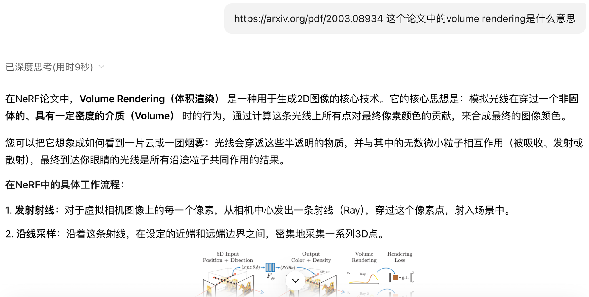
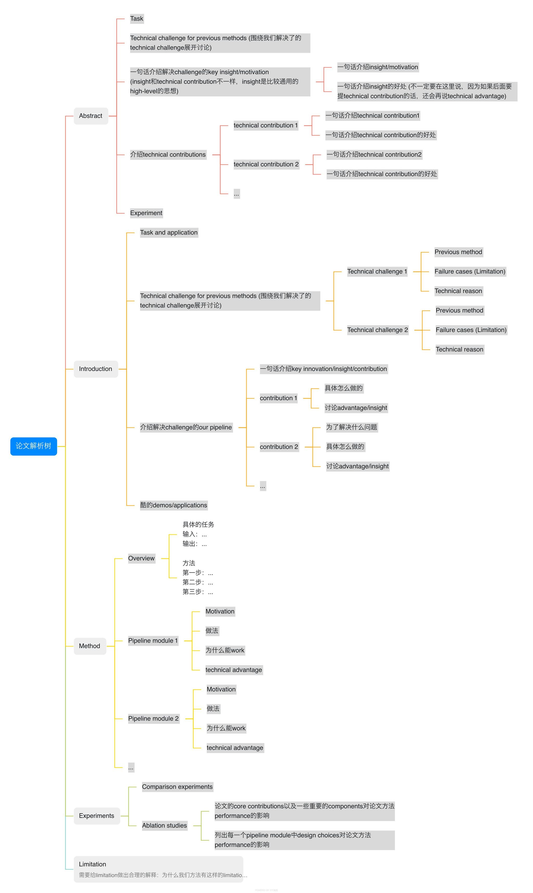
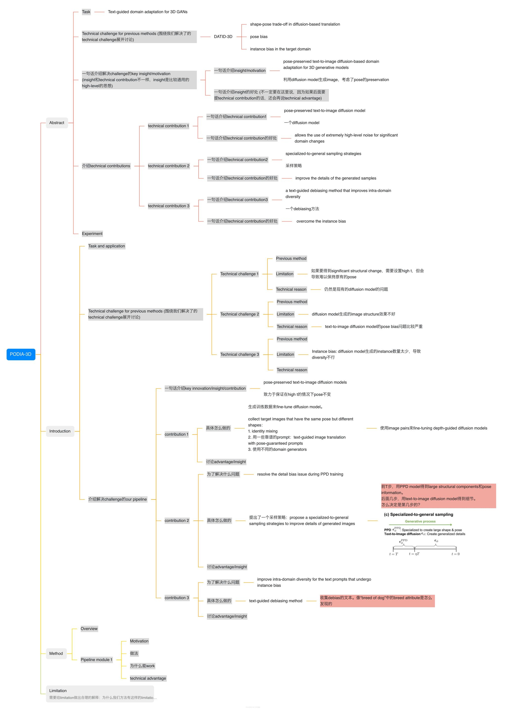

> 文档汇总（GitHub Repo）：<https://github.com/pengsida/learning_research>

有些同学有时候会觉得“看完一篇论文跟没看一样”。可以借助论文解析树来解决这个问题，把读论文变成解答题，从而实现有效地读论文。

具体做法

论文解析树：<https://alidocs.dingtalk.com/i/nodes/mExel2BLV5LaqbQeSx2LpNrAWgk9rpMq>（钉钉脑图。钉钉文档的分享机制不支持直接对外分享，需要另外申请权限。）

边读论文的时候，边回答论文解析树中的问题。

如果读论文过程中有疑问，非常推荐让AI帮忙解答。

如下图所示：

使用论文解析树读论文的一个例子

读论文的三个层次：

第一个层次，基本标准：读懂论文中的所有技术细节和术语（可能需要通过读代码来辅助读懂论文）

第二个层次：知道这篇论文在解决什么问题。知道这篇论文为什么要提出某某技术、为什么这样做会更好。

第三个层次：清楚这篇论文在[literature tree](/f8b36e484b344a2893a94e4608b72ec2?pvs=25)中的位置，并思考要不要更新literature tree中milestone tasks（该科研方向需要解决的重要的问题）。思考这篇论文的limitations（在什么样的数据上会存在failure cases。可能需要通过跑实验来发现failure cases）。

可用于辅助阅读论文的工具：

<https://bohrium.dp.tech/home>

<https://kimi.moonshot.cn/>